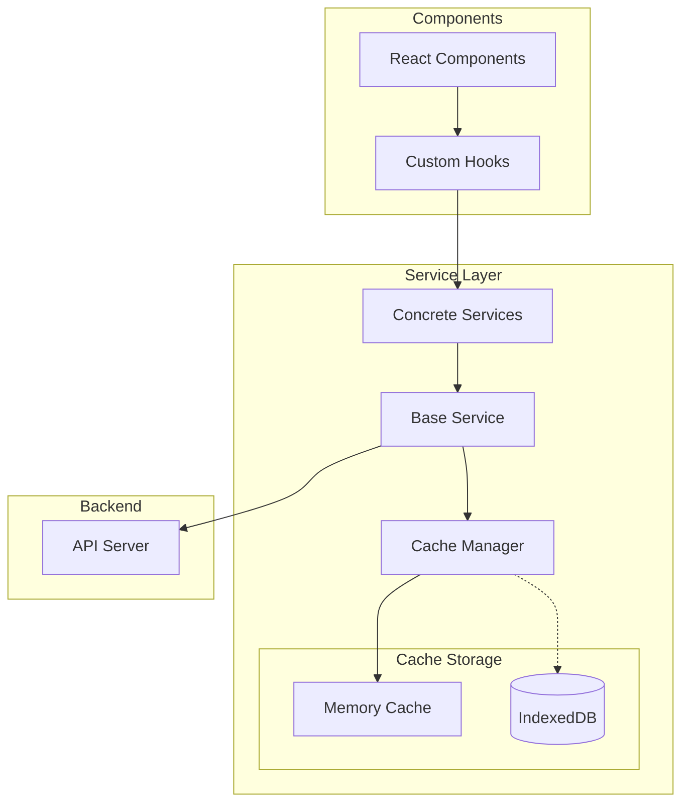

# Caching Strategy

This document outlines the caching strategy used in the Data Dictionary Agency frontend to optimize performance, reduce network load, and improve user experience.

## Overview

The frontend implements a sophisticated caching system to minimize unnecessary API calls and provide a responsive user experience. The caching strategy is designed to balance freshness of data with performance optimization.



## Cache Manager

The `CacheManager` is a central service that handles all caching operations. It provides:

1. **Request Cache**: Stores API responses with configurable time-to-live (TTL)
2. **Pattern-based Invalidation**: Allows clearing related cache entries
3. **Cache Bypass**: Option to skip cache for specific requests
4. **Runtime Configuration**: Cache settings can be adjusted at runtime

### Key Features

- **Time-based expiration**: Cached responses expire after a configured TTL
- **RegExp-based invalidation**: Clear cache entries matching a pattern
- **Memory storage**: Fast in-memory cache with LRU eviction
- **Optional persistence**: Long-term caching via IndexedDB
- **Cache hit/miss tracking**: For performance monitoring

## Cache Keys

Cache keys are generated based on:

1. Request path
2. Query parameters
3. Request body (for POST/PUT requests)

Example:
```javascript
// Request: GET /repositories?limit=10&skip=0
// Cache key: "GET:/repositories?limit=10&skip=0"

// Request: GET /schemas/123
// Cache key: "GET:/schemas/123"

// Request: POST /repositories with body { name: "Test" }
// Cache key: "POST:/repositories:{"name":"Test"}"
```

## TTL Configuration

Each service type has different default TTL settings based on data volatility:

| Service Type | Default TTL | Rationale |
|-------------|-------------|-----------|
| Repository  | 600s (10m)  | Repositories change infrequently |
| Schema      | 300s (5m)   | Schemas may be updated during analysis |
| Format      | 1800s (30m) | Format definitions rarely change |
| Auth        | 120s (2m)   | User authentication state may change |

These values can be overridden for specific requests:

```javascript
// Override TTL for this request to 60 seconds
repositoryService.getAll({}, { ttl: 60 });

// Bypass cache completely
repositoryService.getAll({}, { useCache: false });
```

## Cache Invalidation

Cache invalidation occurs in three ways:

1. **Time-based**: Entries expire after their TTL
2. **Write operations**: Service methods that modify data invalidate related caches
3. **Pattern-based**: Manually invalidate cache entries matching a pattern

### Invalidation Patterns

Each service defines patterns for cache invalidation on write operations:

```javascript
// Example patterns for repository service
const patterns = [
  '^repositories($|\\?)', // Match all repository listings
  `^repositories/${id}($|\\?)` // Match specific repository
];

// Invalidate all matching patterns
patterns.forEach(pattern => {
  this.cacheManager.invalidate(pattern);
});
```

## Best Practices

### Caching GET Requests

- **DO** cache GET requests by default
- **DO** use appropriate TTL values based on data volatility
- **DO** provide cache bypass options for critical data
- **DO NOT** cache sensitive data or frequently changing data

### Handling Write Operations

- **DO** invalidate related caches after successful write operations
- **DO** use pattern-based invalidation to clear related cache entries
- **DO** clear specific cache entries rather than the entire cache
- **DO NOT** clear unrelated caches

### Cache Configuration

- **DO** adjust TTL values based on data access patterns
- **DO** monitor cache hit/miss rates to optimize TTL values
- **DO** consider using longer TTL for reference data
- **DO** use shorter TTL for dynamic data
- **DO NOT** use excessively long TTL values for volatile data

## Cache Invalidation Strategies

### Direct Invalidation

Used when the exact cache key is known:

```javascript
cacheManager.invalidate('GET:/repositories/123');
```

### Pattern Invalidation

Used when multiple related cache entries need invalidation:

```javascript
// Invalidate all repository listings
cacheManager.invalidate('^repositories($|\\?)');

// Invalidate specific repository and its related data
cacheManager.invalidate(`^repositories/${id}`);
```

### Cascading Invalidation

Used for data with dependencies:

```javascript
// When a repository is updated, also invalidate its schemas
cacheManager.invalidate(`^repositories/${id}($|\\?)`);
cacheManager.invalidate(`^schemas\\?.*repository_id=${id}`);
```

## Implementation Example

### Adding Cache Support to a Service Method

```javascript
/**
 * Get all repositories with optional filtering
 * @param {Object} params - Query parameters
 * @param {Object} options - Request options
 * @returns {Promise<Array>} Repositories array
 */
async getAll(params = {}, options = {}) {
  // Generate a unique key for this request
  const requestKey = generateRequestKey('getRepositories', [params]);
  
  // Check for cache unless explicitly bypassed
  if (options.useCache !== false && this.cacheManager) {
    const cached = this.cacheManager.get(`GET:/repositories`, params);
    if (cached) {
      return cached;
    }
  }
  
  try {
    // Make API request
    const response = await this.apiClient.get('/repositories', { params });
    
    // Cache the response with TTL
    if (this.cacheManager) {
      const ttl = options.ttl || this.defaultTTL;
      this.cacheManager.set(`GET:/repositories`, params, response.data, ttl);
    }
    
    return response.data;
  } catch (error) {
    return this.handleError(error);
  }
}
```

### Invalidating Cache After Write Operation

```javascript
/**
 * Create a new repository
 * @param {Object} data - Repository data
 * @param {Object} options - Request options
 * @returns {Promise<Object>} Created repository
 */
async create(data, options = {}) {
  try {
    const response = await this.apiClient.post('/repositories', data);
    
    // Define invalidation patterns
    const patterns = [
      '^repositories($|\\?)', // All repository listings
    ];
    
    // Invalidate cache for all patterns
    if (this.cacheManager) {
      patterns.forEach(pattern => {
        this.cacheManager.invalidate(pattern);
      });
    }
    
    return response.data;
  } catch (error) {
    return this.handleError(error);
  }
}
```

## Cache Manager API

The `CacheManager` provides the following methods:

| Method | Description |
|--------|-------------|
| `get(path, params)` | Get cached value for path and params |
| `set(path, params, value, ttl)` | Set cache value with TTL |
| `invalidate(pattern)` | Invalidate cache entries matching pattern |
| `clear()` | Clear entire cache |
| `getStats()` | Get cache statistics (hits, misses) |
| `setOptions(options)` | Configure cache options |

## Performance Considerations

1. **Memory Usage**: The cache uses LRU eviction to limit memory usage
2. **Invalidation Cost**: Pattern-based invalidation can be expensive with many entries
3. **TTL Tuning**: Appropriate TTL values balance freshness vs. performance
4. **Cache Hits vs. Network**: Monitor cache hit/miss rates to optimize TTL

## Development Guidelines

- **Always invalidate** related caches after write operations
- **Document cache keys** for complex operations
- **Define invalidation patterns** consistently 
- **Consider dependencies** between resources for cascading invalidation
- **Monitor cache hit rates** to tune TTL values
- **Use cache conditionally** for critical operations
