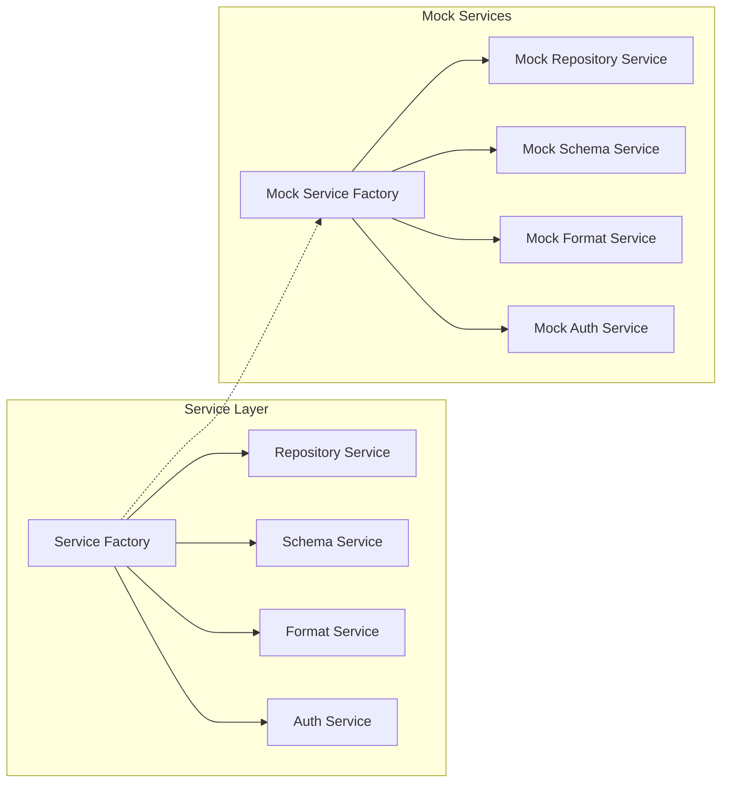

# Service Layer Architecture

This document describes the architecture and design patterns used in the Data Dictionary Agency frontend service layer.

## Overview

The service layer is designed to facilitate communication between the frontend components and the backend API. It provides a consistent interface for data operations while hiding the complexities of API calls, error handling, caching, and network-related concerns.

```mermaid
flowchart TD
    subgraph "Frontend Components"
        COMP[React Components]
        HOOKS[Custom Hooks]
        REDUX[Redux Store]
    end

    subgraph "Service Layer"
        SF[Service Factory]
        RS[Repository Service]
        SS[Schema Service]
        FS[Format Service]
        AS[Auth Service]
        BS[Base Service]
        CM[Cache Manager]
        CB[Circuit Breaker]
    end

    subgraph "API"
        API[Backend API]
        MOCK[Mock Services]
    end

    COMP --> HOOKS
    HOOKS --> SF
    REDUX --> SF
    SF --> RS & SS & FS & AS
    RS & SS & FS & AS --> BS
    BS --> CM
    BS --> CB
    CB --> API
    BS -.-> MOCK
```

## Key Components

### Service Factory

The `ServiceFactory` is the entry point to the service layer. It is responsible for creating and managing service instances, ensuring that only one instance of each service exists throughout the application lifecycle.

```javascript
// Example: Getting a repository service
import { serviceFactory } from '../services/api/serviceFactory';

const repositoryService = serviceFactory.getRepositoryService();
```

### Base Service

The `BaseService` is a foundation class that all specific services inherit from. It provides common functionality such as:

- API client management
- Error handling
- Caching
- Request cancellation
- Circuit breaking

### Specific Services

The service layer includes several specific services, each responsible for a different domain:

- **RepositoryService**: Handles repository management operations
- **SchemaService**: Manages schema-related operations
- **FormatService**: Provides format detection and validation
- **AuthService**: Handles authentication and user management

### Cache Manager

The Cache Manager provides a consistent caching mechanism for all services. It supports:

- Time-based cache invalidation (TTL)
- Pattern-based cache invalidation
- Manual cache clearing

### Circuit Breaker

The Circuit Breaker pattern is implemented to prevent cascading failures when the API is experiencing issues. It:

- Tracks failed requests
- Opens the circuit after a threshold of failures
- Allows limited "test" requests to check if the API has recovered
- Automatically closes the circuit when the API becomes stable

## Mock Services

For development and testing, the service layer supports mock services that provide in-memory implementations of all API services.



### Enabling Mock Services

Mock services are enabled automatically in development mode, but can be configured explicitly:

1. Via environment variables:
   ```
   REACT_APP_USE_MOCK_SERVICES=true
   ```

2. Via query parameters:
   ```
   http://localhost:3000/?mock=true
   ```

3. Programmatically:
   ```javascript
   import { serviceFactory } from '../services/api/serviceFactory';
   serviceFactory.setMockMode(true);
   ```

## Custom React Hooks

The service layer is complemented by custom React hooks that make it easy to use the services in components:

- **useApi**: Generic hook for making API calls with loading/error state management
- **usePaginatedApi**: Extension of useApi with pagination support
- **useRepositories**: Hook for repository operations
- **useSchemas**: Hook for schema operations
- **useFormats**: Hook for format operations
- **useAuth**: Hook for authentication operations

```javascript
// Example: Using the useRepositories hook
import { useRepositories } from '../hooks/useApi';

function RepositoryList() {
  const { repositories, loading, error } = useRepositories();

  if (loading) return <LoadingSpinner />;
  if (error) return <ErrorMessage error={error} />;

  return (
    <ul>
      {repositories.map(repo => (
        <li key={repo.id}>{repo.name}</li>
      ))}
    </ul>
  );
}
```

## Error Handling

The service layer implements a consistent approach to error handling:

1. API errors are caught and transformed into a standardized format
2. Error information includes HTTP status, message, and context
3. Errors can be handled at the service level or propagated to components
4. Network errors are automatically detected and handled
5. Request cancellations are separated from actual errors

## Request Cancellation

To prevent race conditions and memory leaks, the service layer supports request cancellation:

1. Each request generates a unique token based on the operation type and parameters
2. When a new request with the same token is made, the previous one is automatically cancelled
3. Components can explicitly cancel requests when unmounting

```javascript
// Example: Cancelling requests
const { execute, cancel } = useApi(apiFunction);

// On unmount
useEffect(() => {
  return () => {
    cancel();
  };
}, [cancel]);
```

## Best Practices

### Usage in Components

1. Always use the provided hooks rather than directly accessing services
2. Handle loading and error states appropriately
3. Use the `usePaginatedApi` hook for lists that may grow large
4. Cancel requests on component unmount

### Extending the Service Layer

1. All new services should extend `BaseService`
2. Implement cache invalidation patterns for write operations
3. Use mock services for testing
4. Document new service methods with JSDoc comments

### Caching Strategies

1. Use appropriate TTL values based on data volatility
2. Clear related caches when performing write operations
3. Use pattern-based cache invalidation for related resources
4. Consider bypassing the cache for critical read operations

## Development Guidelines

### Adding a New Service

1. Create a new service class extending `BaseService`
2. Implement service-specific methods
3. Add the service to `ServiceFactory`
4. Create corresponding mock implementation
5. Create custom React hooks for the service
6. Write tests for both real and mock implementations

### Testing Services

1. Use the provided test utilities for mocking the API client
2. Test both success and error scenarios
3. Verify cache behavior
4. Test circuit breaker functionality
5. Ensure mock services are consistent with real services
