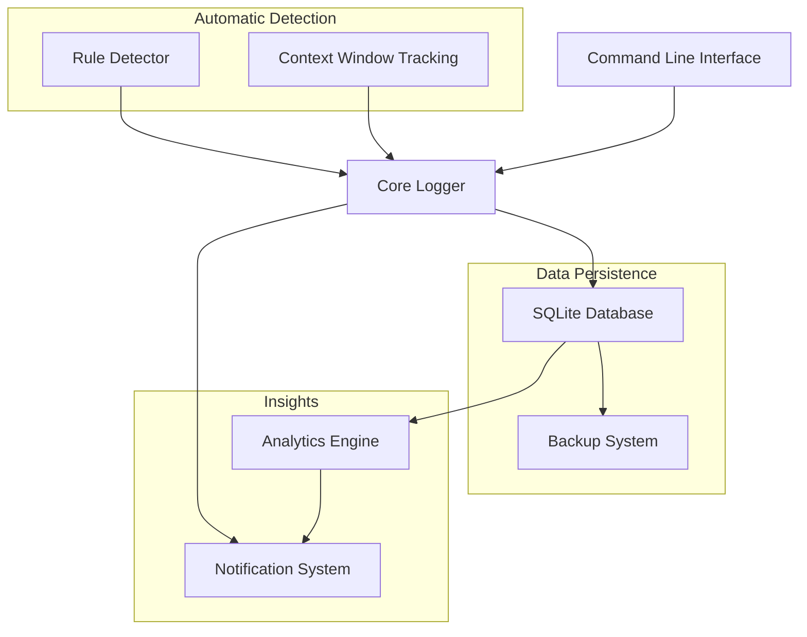
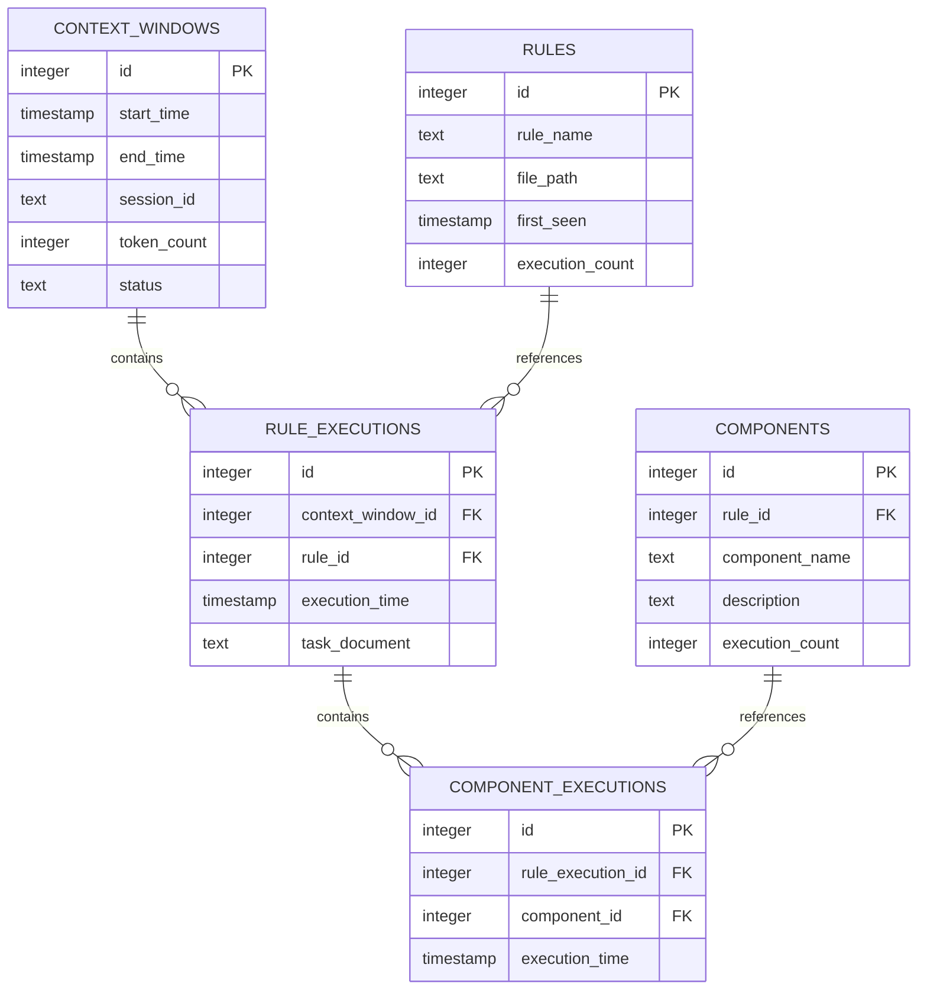

# .clinerules Task Execution Logger - Enhanced Edition

This enhanced utility provides comprehensive tracking, analysis, and management of .clinerules task executions with advanced features including SQLite storage, backup capabilities, analytics insights, and notification of usage patterns.

## Architecture Overview



## Features

### Core Functionality
- Log .clinerules task executions with rich context
- Backward compatible with the legacy logger
- SQLite database for robust data storage and querying
- Command-line and interactive modes

### Advanced Features
- **Context Window Tracking**: Automatically tracks Cline AI context window sessions
- **Rule Detection**: Parses and analyzes .clinerules files for structure
- **Analytics**: Generate metrics and insights on rule usage patterns
- **Notifications**: Detect patterns and receive alerts on significant usage
- **Backup & Restore**: Scheduled backups with retention policies

## Installation

The enhanced logger is included in the Data Dictionary Agency project. No additional installation steps are required.

### Dependencies
Required Python packages (automatically installed with project):
- sqlalchemy
- schedule
- matplotlib (for visualization)

## Usage

### Basic Logging

#### Option 1: Interactive Mode

```bash
python memory-bank/clinerules_logger.py
```

Follow the prompts to enter:
- Task Context Document (e.g., Task_002)
- Referenced .clinerule (e.g., 05-new-task)
- Referenced Component (e.g., "Update the GitHub repository")

#### Option 2: Command Line Mode

```bash
python memory-bank/clinerules_logger.py "Task_002" "05-new-task" "Update the GitHub repository"
```

This directly creates a log entry with the specified parameters.

#### Option 3: Enhanced Command Mode

```bash
python memory-bank/clinerules_logger.py log --rule-name "05-new-task" --component-name "Update the GitHub repository" --task-document "Task_002"
```

### Analytics & Insights

#### Generate Metrics Report

```bash
python memory-bank/clinerules_logger.py metrics --days 30 --output "metrics_report.json"
```

Parameters:
- `--days` or `-d`: Number of days to include in the report (default: 30)
- `--output` or `-o`: Output file path (default: auto-generated filename)

#### Detect and Display Patterns

```bash
python memory-bank/clinerules_logger.py patterns
```

This analyzes log data to detect patterns such as:
- Frequently used rules
- Frequently used components
- Rules that are commonly used together

### Backup Management

#### Create Manual Backup

```bash
python memory-bank/clinerules_logger/main.py backup
```

#### List Available Backups

```bash
python memory-bank/clinerules_logger/main.py backups
```

#### Restore from Backup

```bash
python memory-bank/clinerules_logger/main.py restore --path "/path/to/backup.db.zip"
```

## Database Schema

The enhanced logger uses a SQLite database with the following schema:

### Core Tables

- **context_windows**: Tracks Cline AI context window sessions
- **rules**: Stores information about .clinerules files
- **components**: Stores sections/components within rules
- **rule_executions**: Logs each execution of a rule
- **component_executions**: Logs each execution of a component
- **notifications**: Stores generated notifications based on patterns



## Context Window Integration

The system can automatically detect and track Cline's context window usage, correlating rule executions with specific context windows.

Benefits:
1. Understand which rules are triggered in a single context window session
2. Track token usage alongside rule executions
3. Analyze patterns of rule usage across context window boundaries

## Backup System

The backup system automatically maintains database backups with:

- Scheduled daily backups (configurable)
- Compressed storage to save space
- Configurable retention policy (default: 30 days)
- Point-in-time recovery with pre-restore protection

## Notification System

The system can detect and notify about:

1. **Frequent Rule Usage**: Rules that are used more than a threshold number of times in a period
2. **Frequent Component Usage**: Components that are frequently triggered
3. **Co-occurrence Patterns**: Rules that are commonly used together

Notifications are stored in the database and can be displayed during system initialization.

## Configuration

Configuration is stored in `memory-bank/clinerules_logger/config.json` and includes:

- Database settings
- Backup configuration
- Notification thresholds
- Legacy log import settings

## Best Practices

1. **Regular Logging**: Create a log entry after each .clinerules task execution
2. **Review Analytics**: Periodically review the metrics reports to understand usage patterns
3. **Maintain Backups**: Ensure the backup system is running correctly
4. **Custom Tracking**: For complex workflows, use task_document to track additional context
5. **Pattern Analysis**: Check for patterns periodically to optimize your rule usage

## Technical Details

- The SQLite database is stored at: `memory-bank/clinerules_logger/data/clinerules.db`
- Backups are stored at: `memory-bank/clinerules_logger/backup/data/`
- Legacy log import happens automatically on first run
- The system uses SQLAlchemy ORM for database operations
- All database operations are thread-safe

## Troubleshooting

### Database Issues
If database corruption occurs, you can restore from a backup:
```bash
python memory-bank/clinerules_logger/main.py restore --path "path/to/backup.db.zip"
```

### Missing Log Entries
If log entries are missing, check:
1. The Cline rules directory path in rule_detector.py
2. The context window tracking status in config.json

### Legacy vs Enhanced Mode
The system automatically falls back to legacy mode if the enhanced system cannot be imported. This ensures backward compatibility.

## Extending the System

The modular design allows for easy extension:
- Add new metrics to the analytics engine
- Implement additional pattern detection algorithms
- Create new notification types
- Enhance rule detection capabilities

## Migration from Legacy Logs

The system automatically imports data from the legacy log file on first run. This ensures all historical data is preserved in the new SQLite database.
