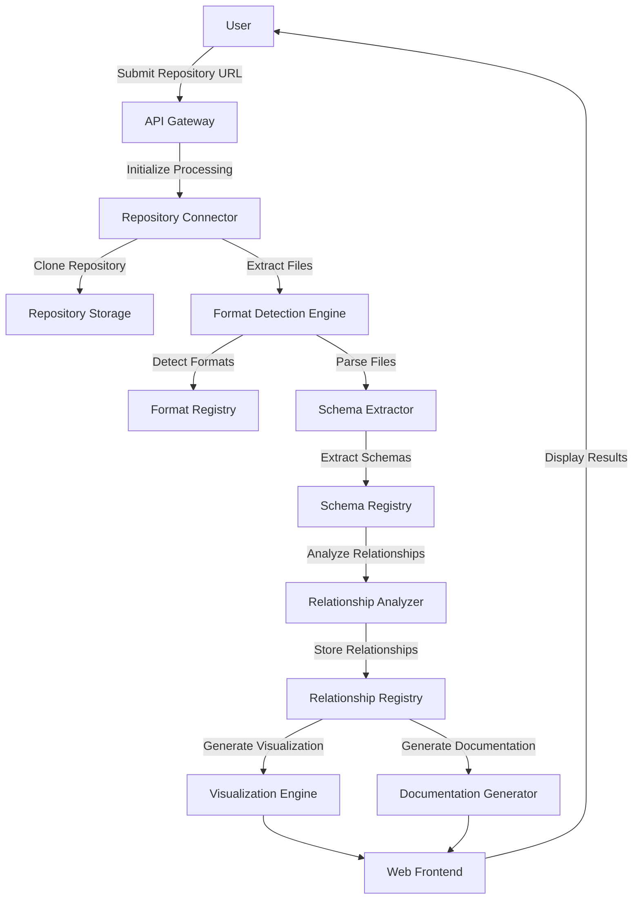
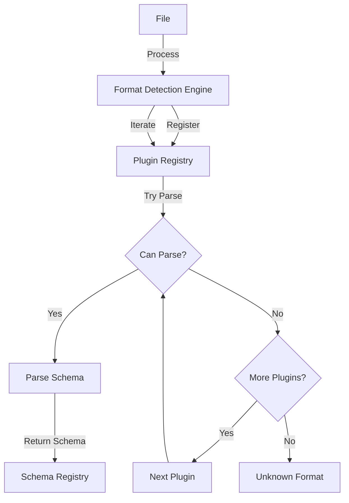

# CodeMap Root: Data Dictionary Agency (DDA)
timestamp: 2025-04-25T22:37:00-07:00

## ACTIVE_MEMORY
- Components: [#FD_GRAPHQL, #FD_JSON_SCHEMA, #FD_SQL_NEW, #FD_CORE, #FD_YAML_NEW] (currently in focus)
- Decisions: [#ARCH_002, #FD_001] (relevant to current task)
- Patterns: [@Plugin, @Strategy, @Factory] (applied in this task)
- Tasks: [TASK_002] (second sprint - format expansion)

## PROJECT_STRUCTURE
[data-dictionary-agency]/ # Project Root
  [src]/ [CORE]
    [api]/ [API] # API Gateway and Controllers
      [controllers]/ # Request handlers for the API endpoints
        api_controller.py #[API_CORE] "Main API controller" @patterns[RestController] @index[api]
        repository_controller.py #[API_REPO] "Repository controller" @patterns[RestController] @index[api]
        format_controller.py #[API_FORMAT] "Format detection controller" @patterns[RestController] @index[api]
        visualization_controller.py #[API_VIZ] "Visualization controller" @patterns[RestController] @index[api]
        documentation_controller.py #[API_DOC] "Documentation controller" @patterns[RestController] @index[api]
      api_models.py #[API_MODELS] "API data models" @index[api]
      app.py #[API_APP] "FastAPI application" @patterns[Application] @index[api] ^critical
    [repository]/ [RC] # Repository Access and Management
      connector.py #[RC_GITHUB] "GitHub connector" @patterns[Adapter] @index[repository] ^critical
      clone_manager.py #[RC_CLONE] "Repository cloning manager" @patterns[Factory] @index[repository]
      path_traversal.py #[RC_PATH] "Path traversal utilities" @index[repository]
      file_extractor.py #[RC_FILE] "File extraction utilities" @index[repository]
    [formats]/ [FD] # Format Detection and Parsing
      detector.py #[FD_CORE] "Format detection engine" @patterns[Strategy] @index[formats] ^critical
      plugins/
        base.py #[FD_BASE] "Base parser interface" @patterns[Plugin] @index[formats] ^critical
        json_parser.py #[FD_JSON] "JSON format parser" @patterns[Plugin] @index[formats]
        csv_parser.py #[FD_CSV] "CSV format parser" @patterns[Plugin] @index[formats]
        <!-- Older parsers will be migrated to the new structure -->
        xml_parser.py #[FD_XML_OLD] "Legacy XML format parser" @deprecated @index[formats]
        yaml_parser.py #[FD_YAML] "YAML format parser" @patterns[Plugin] @index[formats]
        sql_parser.py #[FD_SQL] "SQL format parser" @patterns[Plugin] @index[formats]
        excel_parser.py #[FD_EXCEL] "Excel format parser" @patterns[Plugin] @index[formats]
        protobuf_parser.py #[FD_PROTO] "Protobuf format parser" @patterns[Plugin] @index[formats]
        graphql_parser.py #[FD_GRAPHQL] "GraphQL format parser" @patterns[Plugin] @index[formats]
        avro_parser.py #[FD_AVRO] "Avro format parser" @patterns[Plugin] @index[formats]
        parquet_parser.py #[FD_PARQUET] "Parquet format parser" @patterns[Plugin] @index[formats]
        hdf5_parser.py #[FD_HDF5] "HDF5 format parser" @patterns[Plugin] @index[formats]
        orc_parser.py #[FD_ORC] "ORC format parser" @patterns[Plugin] @index[formats]
    [schemas]/ [SE] # Schema Extraction and Management
      extractor.py #[SE_CORE] "Schema extraction service" @index[schemas]
      models.py #[SE_MODELS] "Schema data models" @index[schemas] ^critical
      type_inference.py #[SE_TYPE] "Type inference utilities" @index[schemas]
      constraints.py #[SE_CONSTRAINT] "Constraint detection" @index[schemas]
    [relationships]/ [RA] # Relationship Analysis
      analyzer.py #[RA_CORE] "Relationship analysis service" @patterns[Composite] @index[relationships]
      strategies/
        name_based.py #[RA_NAME] "Name-based detection strategy" @patterns[Strategy] @index[relationships]
        type_based.py #[RA_TYPE] "Type-based detection strategy" @patterns[Strategy] @index[relationships]
        content_based.py #[RA_CONTENT] "Content-based detection strategy" @patterns[Strategy] @index[relationships]
      confidence.py #[RA_CONF] "Confidence scoring" @index[relationships]
      cardinality.py #[RA_CARD] "Cardinality detection" @index[relationships]
    [visualization]/ [VE] # Visualization Engine
      generator.py #[VE_GEN] "ER diagram generator" @patterns[Builder] @index[visualization]
      renderer.py #[VE_RENDER] "Interactive rendering engine" @index[visualization]
      layouts.py #[VE_LAYOUT] "Layout algorithms" @index[visualization]
      exporters.py #[VE_EXPORT] "Visualization export utilities" @index[visualization]
    [documentation]/ [DG] # Documentation Generator
      generator.py #[DG_GEN] "Documentation generator" @patterns[TemplateMethod] @index[documentation]
      templates.py #[DG_TEMPLATE] "Template management" @index[documentation]
      exporters.py #[DG_EXPORT] "Documentation export utilities" @index[documentation]
      example_generator.py #[DG_EXAMPLE] "Example generator" @index[documentation]
    [database]/ [DB] # Database Access and Models
      models/
        repository.py #[DB_REPO] "Repository model" @index[database]
        format.py #[DB_FORMAT] "Format model" @index[database]
        schema.py #[DB_SCHEMA] "Schema model" @index[database] ^critical
        relationship.py #[DB_REL] "Relationship model" @index[database]
        visualization.py #[DB_VIZ] "Visualization model" @index[database]
        documentation.py #[DB_DOC] "Documentation model" @index[database]
      repositories/ # Repository pattern implementations
        base.py #[DB_BASE_REPO] "Base repository pattern" @patterns[Repository] @index[database]
        repository_repo.py #[DB_REPO_REPO] "Repository data access" @patterns[Repository] @index[database]
        schema_repo.py #[DB_SCHEMA_REPO] "Schema data access" @patterns[Repository] @index[database]
      connection.py #[DB_CONN] "Database connection management" @index[database]
    [workers]/ [WK] # Worker Management for Distributed Processing
      worker.py #[WK_BASE] "Base worker functionality" @index[workers]
      task_queue.py #[WK_QUEUE] "Task queue management" @index[workers]
      coordinator.py #[WK_COORD] "Worker coordination" @index[workers]
    [utils]/ [UTIL] # Utility Functions and Helpers
      logging.py #[UTIL_LOG] "Logging utilities" @index[utils]
      error_handling.py #[UTIL_ERR] "Error handling utilities" @index[utils]
      file_handling.py #[UTIL_FILE] "File utilities" @index[utils]
      performance.py #[UTIL_PERF] "Performance monitoring" @index[utils]
    [format_detection]/ [FD_NEW] # New Format Detection Module
      __init__.py # Module initialization
      models.py # Updated format detection models
      service.py # Format detection service
      [core]/ # Core detection functionality
        __init__.py # Module initialization
      [plugins]/ # Format parser plugins
        __init__.py # Plugin registration system
        [avro]/ # Avro format parser
          __init__.py #[FD_AVRO] "Avro schema parser" @patterns[Plugin] @index[formats]
        [csv]/ # CSV format parser
          __init__.py #[FD_CSV_NEW] "CSV/TSV format parser" @patterns[Plugin] @index[formats]
        [graphql]/ # GraphQL format parser
          __init__.py #[FD_GRAPHQL] "GraphQL schema parser" @patterns[Plugin] @index[formats]
        [json]/ # JSON format parser
          __init__.py #[FD_JSON_NEW] "JSON format parser" @patterns[Plugin] @index[formats]
        [json_schema]/ # JSON Schema parser
          __init__.py #[FD_JSON_SCHEMA] "JSON Schema parser" @patterns[Plugin] @index[formats]
        [openapi]/ # OpenAPI/Swagger parser
          __init__.py #[FD_OPENAPI] "OpenAPI/Swagger parser" @patterns[Plugin] @index[formats]
        [orc]/ # ORC format parser
          __init__.py #[FD_ORC_NEW] "ORC format parser" @patterns[Plugin] @index[formats]
        [parquet]/ # Parquet format parser
          __init__.py #[FD_PARQUET_NEW] "Parquet format parser" @patterns[Plugin] @index[formats]
        [protobuf]/ # Protobuf format parser
          __init__.py #[FD_PROTO_NEW] "Protobuf format parser" @patterns[Plugin] @index[formats]
        [sql]/ # SQL format parser
          __init__.py #[FD_SQL_NEW] "SQL format parser with dialect detection and relationship extraction" @patterns[Plugin] @index[formats] @tasks[TASK_002] ✅
        [xml]/ # XML format parser
          __init__.py #[FD_XML] "Enhanced XML parser with XSD/DTD support" @patterns[Plugin] @index[formats]
        [yaml]/ # YAML format parser
          __init__.py #[FD_YAML_NEW] "YAML format parser" @patterns[Plugin] @index[formats] @tasks[TASK_002] ✅
      [type_inference]/ # Type inference enhancements
        __init__.py # Module initialization
        enhancers.py # Type enhancer implementations
        integration.py # Integration with format detection
        models.py # Type inference models
        service.py # Type inference service
    [config]/ [CONF] # Configuration Management
      settings.py #[CONF_SETTINGS] "Application settings" @index[config]
      environment.py #[CONF_ENV] "Environment configuration" @index[config]
  [web]/ [WEB] # Web Frontend
    [src]/
      [components]/ # React components
      [pages]/ # Page definitions
      [state]/ # Redux state management
      [services]/ # API client services
  [tests]/ # Test Suite
    [unit]/ # Unit tests
    [integration]/ # Integration tests
    [performance]/ # Performance tests
    [fixtures]/ # Test fixtures and data
  [docs]/ # Documentation
    [api]/ # API documentation
    [architecture]/ # Architecture documentation
    [user-guides]/ # User guides
  [deployment]/ # Deployment Configurations
    [docker]/ # Docker configurations
    [kubernetes]/ # Kubernetes configurations
  [scripts]/ # Utility Scripts
    setup.py # Setup script
    seed_data.py # Data seeding script

## FLOW_DIAGRAMS

### Repository Processing Flow


### Format Detection Plugin Flow


### Relationship Detection Flow
```mermaid
sequenceDiagram
    participant SE as Schema Extractor
    participant RA as Relationship Analyzer
    participant NS as Name Strategy
    participant TS as Type Strategy
    participant CS as Content Strategy
    participant CM as Confidence Model
    participant DB as Database
    
    SE->>RA: Pass Extracted Schemas
    RA->>NS: Apply Name-Based Strategy
    NS-->>RA: Return Potential Relationships
    RA->>TS: Apply Type-Based Strategy
    TS-->>RA: Return Potential Relationships
    RA->>CS: Apply Content-Based Strategy
    CS-->>RA: Return Potential Relationships
    RA->>CM: Calculate Confidence Scores
    CM-->>RA: Return Scored Relationships
    RA->>DB: Store Relationships
