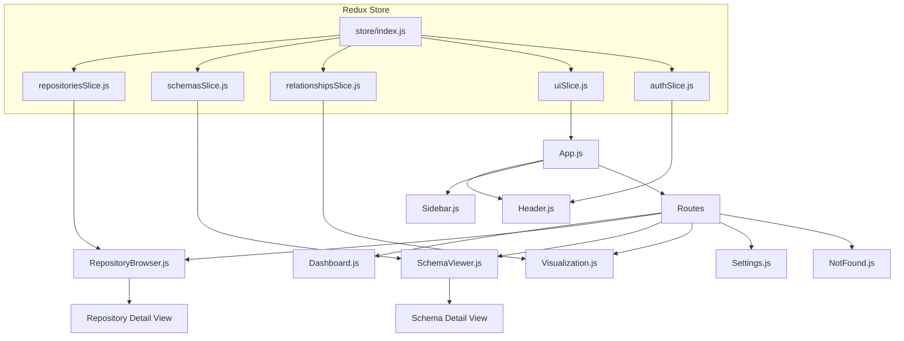
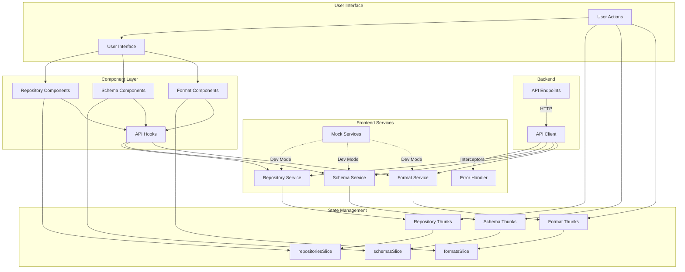

# CodeMap Root
timestamp: 2025-05-03T09:07:00-07:00

## ACTIVE_MEMORY
- Components: [#UI_Framework, #API_Integration, #Redux_Store, #Component_Library, #Testing, #API_Documentation]
- Decisions: [#UI_001, #TECH_001, #TEST_001, #UI_002, #UI_003, #UI_004, #UI_005, #UI_006]
- Patterns: [@Redux, @ComponentBased, @ResponsiveDesign, @MockTesting, @ServiceLayer, @CircuitBreaker, @Caching]
- Tasks: [TASK_002]

## PROJECT_STRUCTURE
[root_directory]/
  [src_directory]/ [CORE]
    [api_directory]/ [API]
      routes.js #[API_ROUTES] "API Routes" @patterns[REST] @index[api]
      [endpoints_directory]/
        formats.py #[FORMATS_API] "Formats API" @key @deps[#FORMAT_DETECTION] @index[api]
        repositories.py #[REPO_API] "Repositories API" @key @deps[#REPO_SERVICE] @index[api]
        schemas.py #[SCHEMA_API] "Schemas API" @key @deps[#SCHEMA_SERVICE] @index[api]
    
    [core_directory]/ [CORE]
      config.py #[CONFIG] "Configuration" @index[core]
      logging.py #[LOGGING] "Logging" @index[core]
    
    [db_directory]/ [DATA]
      database.py #[DB_CONNECTION] "Database Connection" @index[db]
      models.py #[DB_MODELS] "Database Models" @key @index[db]
      service.py #[DB_SERVICE] "Database Service" @deps[#DB_MODELS] @index[db]
    
    [format_detection_directory]/ [DETECTION]
      models.py #[FORMAT_MODELS] "Format Models" @index[formats]
      service.py #[FORMAT_SERVICE] "Format Detection Service" @key @index[formats]
      [plugins_directory]/
        avro/ #[AVRO_PLUGIN] "Avro Plugin" @index[plugins]
        csv/ #[CSV_PLUGIN] "CSV Plugin" @index[plugins]
        graphql/ #[GRAPHQL_PLUGIN] "GraphQL Plugin" @index[plugins]
        json/ #[JSON_PLUGIN] "JSON Plugin" @index[plugins]
        json_schema/ #[JSON_SCHEMA_PLUGIN] "JSON Schema Plugin" @index[plugins]
        openapi/ #[OPENAPI_PLUGIN] "OpenAPI Plugin" @index[plugins]
        orc/ #[ORC_PLUGIN] "ORC Plugin" @index[plugins]
        parquet/ #[PARQUET_PLUGIN] "Parquet Plugin" @index[plugins]
        protobuf/ #[PROTOBUF_PLUGIN] "Protobuf Plugin" @index[plugins]
        sql/ #[SQL_PLUGIN] "SQL Plugin" @index[plugins]
        xml/ #[XML_PLUGIN] "XML Plugin" @index[plugins]
        yaml/ #[YAML_PLUGIN] "YAML Plugin" @index[plugins]
    
    [relationship_detection_directory]/ [DETECTION]
      models.py #[REL_MODELS] "Relationship Models" @index[relationships]
      service.py #[REL_SERVICE] "Relationship Detection Service" @key @index[relationships]
    
    [repository_directory]/ [REPO]
      github_client.py #[GH_CLIENT] "GitHub Client" @index[repository]
      models.py #[REPO_MODELS] "Repository Models" @index[repository]
      service.py #[REPO_SERVICE] "Repository Service" @key @index[repository]
    
    [ui_directory]/ [UI] ^critical @tasks[TASK_002]
      index.html #[UI_HTML] "HTML Template" @index[ui]
      index.js #[UI_ENTRY] "UI Entry Point" @patterns[React] @index[ui]
      App.js #[UI_APP] "App Component" @key @deps[#UI_ROUTER] @index[ui]
      
      [components_directory]/ [UI_COMPONENTS]
        [layout_directory]/
          Header.js #[UI_HEADER] "Header Component" @key @index[components]
          Sidebar.js #[UI_SIDEBAR] "Sidebar Component" @key @index[components]
      
      [pages_directory]/ [UI_PAGES]
        Dashboard.js #[UI_DASHBOARD] "Dashboard Page" @key @index[pages]
        RepositoryBrowser.js #[UI_REPO_BROWSER] "Repository Browser Page" @key @deps[#REPO_SLICE] @index[pages]
        SchemaViewer.js #[UI_SCHEMA_VIEWER] "Schema Viewer Page" @key @deps[#SCHEMA_SLICE] @index[pages]
        Visualization.js #[UI_VISUALIZATION] "Visualization Page" @key @deps[#VIZ_RENDERER] @index[pages]
        Settings.js #[UI_SETTINGS] "Settings Page" @key @index[pages]
        NotFound.js #[UI_404] "Not Found Page" @index[pages]
      
      [store_directory]/ [UI_STORE]
        index.js #[UI_STORE_CONFIG] "Redux Store Configuration" @patterns[Redux] @index[store]
        [slices_directory]/
          repositoriesSlice.js #[REPO_SLICE] "Repositories Slice" @key @deps[#API_ROUTES] @index[store]
          schemasSlice.js #[SCHEMA_SLICE] "Schemas Slice" @key @deps[#API_ROUTES] @index[store]
          relationshipsSlice.js #[REL_SLICE] "Relationships Slice" @key @deps[#API_ROUTES] @index[store]
          uiSlice.js #[UI_SLICE] "UI State Slice" @index[store]
          authSlice.js #[AUTH_SLICE] "Authentication Slice" @key @deps[#API_ROUTES] @index[store]
          [__tests__]/
            repositoriesSlice.test.js #[REPO_SLICE_TESTS] "Repositories Slice Tests" @deps[#REPO_SLICE] @index[tests]
            schemasSlice.test.js #[SCHEMA_SLICE_TESTS] "Schemas Slice Tests" @deps[#SCHEMA_SLICE] @index[tests]
            formatsSlice.test.js #[FORMAT_SLICE_TESTS] "Formats Slice Tests" @deps[#FORMAT_SLICE] @index[tests]
            authSlice.test.js #[AUTH_SLICE_TESTS] "Auth Slice Tests" @deps[#AUTH_SLICE] @index[tests]
            uiSlice.test.js #[UI_SLICE_TESTS] "UI Slice Tests" @deps[#UI_SLICE] @index[tests]
      
      [theme_directory]/ [UI_THEME]
        index.js #[UI_THEME_CONFIG] "Theme Configuration" @patterns[ChakraUI] @index[theme]
      
      [hooks_directory]/ [UI_HOOKS]
        useApi.js #[UI_API_HOOK] "API Hooks" @key @deps[#UI_API_CLIENT, #UI_CANCEL_TOKEN] @index[hooks] @tasks[TASK_002]
        __tests__/
          useApi.test.js #[UI_API_HOOK_TESTS] "API Hook Tests" @deps[#UI_API_HOOK] @index[tests]
      
      [services_directory]/ [UI_SERVICES]
        [api_directory]/ [UI_API] ^critical @tasks[TASK_002]
          client.js #[UI_API_CLIENT] "API Client" @key @patterns[Interceptor] @index[services]
          cancelToken.js #[UI_CANCEL_TOKEN] "Cancel Token Utilities" @key @index[services]
          repositories.js #[UI_REPO_SERVICE] "Repository Service" @key @deps[#UI_API_CLIENT, #UI_CANCEL_TOKEN] @index[services]
          schemas.js #[UI_SCHEMA_SERVICE] "Schema Service" @key @deps[#UI_API_CLIENT, #UI_CANCEL_TOKEN] @index[services]
          formats.js #[UI_FORMAT_SERVICE] "Format Service" @key @deps[#UI_API_CLIENT, #UI_CANCEL_TOKEN] @index[services]
          __tests__/
            client.test.js #[UI_CLIENT_TESTS] "API Client Tests" @deps[#UI_API_CLIENT] @index[tests]
            repositories.test.js #[UI_REPO_SERVICE_TESTS] "Repository Service Tests" @deps[#UI_REPO_SERVICE] @index[tests]
        
        [mock_directory]/ [UI_MOCK]
          index.js #[UI_MOCK_SERVICE] "Mock Service" @deps[#UI_API_CLIENT] @index[services]
          [data_directory]/ [UI_MOCK_DATA]
            repositories.js #[UI_MOCK_REPOS] "Mock Repository Data" @index[mock]
            schemas.js #[UI_MOCK_SCHEMAS] "Mock Schema Data" @index[mock]
            formats.js #[UI_MOCK_FORMATS] "Mock Format Data" @index[mock]
      [utils_directory]/ [UI_UTILS]
      [assets_directory]/ [UI_ASSETS]
    
    [utils_directory]/ [UTIL]
      __init__.py #[UTILS] "Utilities" @index[utils]
    
    [visualization_directory]/ [VIZ]
      index.js #[VIZ_ENTRY] "Visualization Entry" @index[visualization]
      [renderers_directory]/
        base-renderer.js #[VIZ_BASE_RENDERER] "Base Renderer" @patterns[Strategy] @index[renderers]
        renderer-factory.js #[VIZ_RENDERER_FACTORY] "Renderer Factory" @patterns[Factory] @index[renderers]
        d3-renderer.js #[VIZ_D3_RENDERER] "D3 Renderer" @key @deps[#VIZ_BASE_RENDERER] @index[renderers]
        index.js #[VIZ_RENDERERS] "Renderers Index" @index[renderers]

  [memory-bank_directory]/ # Contains documentation and memory
    CHANGELOG.md #[CHANGELOG] "Change Log" @index[memory]
    codeMap_root.md #[CODEMAP] "Code Map" @key @index[memory]
    activeContext.md #[ACTIVE_CONTEXT] "Active Context" @key @index[memory]
    techContext.md #[TECH_CONTEXT] "Technical Context" @index[memory]
    systemPatterns.md #[SYSTEM_PATTERNS] "System Patterns" @index[memory]
    progress.md #[PROGRESS] "Progress Report" @index[memory]
    decisions.md #[DECISIONS] "Decisions Journal" @index[memory]
    
    [tasks_directory]/
      task_registry.md #[TASK_REGISTRY] "Task Registry" @key @index[tasks]
      task_001_first_sprint.md #[TASK_001] "First Sprint" @index[tasks]
      task_002_second_sprint.md #[TASK_002] "Second Sprint" @key @index[tasks]
      task_003_third_sprint.md #[TASK_003] "Third Sprint" @index[tasks]
    
    [indexes_directory]/
      formats_index.yaml #[FORMATS_INDEX] "Formats Index" @index[indexes]
      repository_index.yaml #[REPO_INDEX] "Repository Index" @index[indexes]
      database_index.yaml #[DB_INDEX] "Database Index" @index[indexes]

  [docs_directory]/ # Contains technical documentation
    api-system-architecture.md #[API_ARCH_DOC] "API System Architecture" @key @index[docs] @tasks[TASK_002]
    service-layer-architecture.md #[SVC_ARCH_DOC] "Service Layer Architecture" @key @index[docs] @tasks[TASK_002]
    service-layer-implementation.md #[SVC_IMPL_DOC] "Service Layer Implementation" @index[docs] @tasks[TASK_002]
    service-layer-overview.md #[SVC_OVER_DOC] "Service Layer Overview" @index[docs] @tasks[TASK_002]
    service-layer-best-practices.md #[SVC_BEST_DOC] "Service Layer Best Practices" @index[docs] @tasks[TASK_002]
    caching-strategy.md #[CACHE_DOC] "Caching Strategy" @index[docs] @tasks[TASK_002]
    caching-strategy-core.md #[CACHE_CORE_DOC] "Caching Strategy Core" @index[docs] @tasks[TASK_002]
    caching-strategy-advanced.md #[CACHE_ADV_DOC] "Caching Strategy Advanced" @index[docs] @tasks[TASK_002]
    api-developer-guide.md #[API_DEV_DOC] "API Developer Guide" @index[docs] @tasks[TASK_002]
    api-developer-guide-basics.md #[API_BASICS_DOC] "API Developer Guide Basics" @index[docs] @tasks[TASK_002]
    api-developer-guide-advanced.md #[API_ADV_DOC] "API Developer Guide Advanced" @index[docs] @tasks[TASK_002]
    api-developer-guide-react.md #[API_REACT_DOC] "API Developer Guide React" @index[docs] @tasks[TASK_002]
    api-endpoints-index.md #[API_EP_INDEX] "API Endpoints Index" @index[docs] @tasks[TASK_002]
    api-endpoints-repository.md #[API_EP_REPO] "API Endpoints Repository" @index[docs] @tasks[TASK_002]
    api-endpoints-schema.md #[API_EP_SCHEMA] "API Endpoints Schema" @index[docs] @tasks[TASK_002]
    api-endpoints-format.md #[API_EP_FORMAT] "API Endpoints Format" @index[docs] @tasks[TASK_002]
    api-endpoints-auth.md #[API_EP_AUTH] "API Endpoints Auth" @index[docs] @tasks[TASK_002]
    api-endpoints-catalog.md #[API_EP_CATALOG] "API Endpoints Catalog" @index[docs] @tasks[TASK_002]
    technical-documentation-results.md #[TECH_DOC_RESULTS] "Technical Documentation Results" @index[docs] @tasks[TASK_002]
    [examples_directory]/
      [api_directory]/
        api-client-setup.ts #[API_CLIENT_EX] "API Client Setup Example" @index[examples] @tasks[TASK_002]
        base-service.ts #[BASE_SVC_EX] "Base Service Example" @index[examples] @tasks[TASK_002]
        custom-hooks.tsx #[HOOKS_EX] "Custom Hooks Example" @index[examples] @tasks[TASK_002]
        redux-slice.ts #[REDUX_EX] "Redux Integration Example" @index[examples] @tasks[TASK_002]
        index.md #[EXAMPLES_INDEX] "Examples Index" @index[examples] @tasks[TASK_002]

  [tests_directory]/ # Contains test suite
    [unit_directory]/ [TESTS]
    [integration_directory]/ [TESTS]
    [fixtures_directory]/ [TESTS]

## FLOW_DIAGRAMS

### UI Component Hierarchy


### Data Flow


### Redux Testing Flow
```mermaid
flowchart TD
    subgraph Testing Framework
        MockStore[configureMockStore] --> TestCase[Redux Test Case]
        MockThunk[Mock Async Thunk] --> TestCase
        TestCase --> ActionTest[Test Action Creator]
        TestCase --> ReducerTest[Test Reducer]
        TestCase --> SelectorTest[Test Selector]
        TestCase --> ThunkTest[Test Async Thunk]
    end
    
    subgraph TestProcess
        PrepareState[Prepare Initial State] --> CreateMockStore[Create Mock Store]
        CreateMockStore --> DispatchAction[Dispatch Action]
        DispatchAction --> GetActions[Get Actions from Store]
        GetActions --> AssertType[Assert Action Type]
        AssertType --> AssertPayload[Assert Action Payload]
    end
    
    subgraph TestScenarios
        SuccessTest[Test Success Path] --> HappyPath[Check Correct State Updates]
        FailureTest[Test Failure Path] --> ErrorHandling[Check Error State Updates]
        EdgeTest[Test Edge Cases] --> EmptyState[Check Empty State Handling]
        EdgeTest --> SpecialCase[Check Special Case Handling]
    end
    
    MockStore --> PrepareState
    DispatchAction --> SuccessTest
    DispatchAction --> FailureTest
    DispatchAction --> EdgeTest
