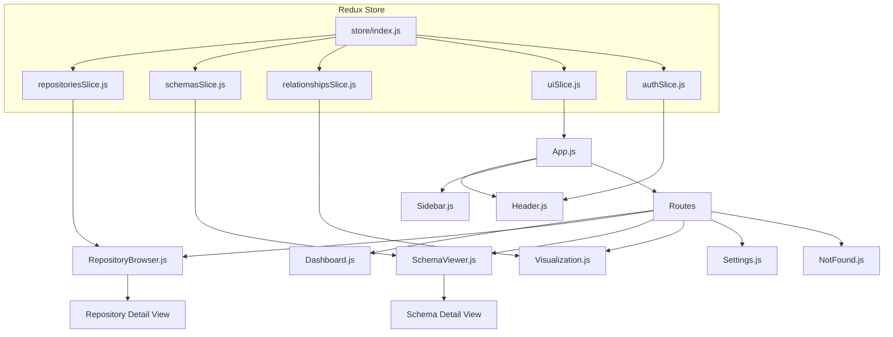

# CodeMap Root
timestamp: 2025-04-27T15:52:00-07:00

## ACTIVE_MEMORY
- Components: [#UI_Framework, #API_Integration, #Redux_Store, #Component_Library]
- Decisions: [#UI_001, #TECH_001]
- Patterns: [@Redux, @ComponentBased, @ResponsiveDesign]
- Tasks: [TASK_002]

## PROJECT_STRUCTURE
[root_directory]/
  [src_directory]/ [CORE]
    [api_directory]/ [API]
      routes.js #[API_ROUTES] "API Routes" @patterns[REST] @index[api]
      [endpoints_directory]/
        formats.py #[FORMATS_API] "Formats API" @key @deps[#FORMAT_DETECTION] @index[api]
        repositories.py #[REPO_API] "Repositories API" @key @deps[#REPO_SERVICE] @index[api]
        schemas.py #[SCHEMA_API] "Schemas API" @key @deps[#SCHEMA_SERVICE] @index[api]
    
    [core_directory]/ [CORE]
      config.py #[CONFIG] "Configuration" @index[core]
      logging.py #[LOGGING] "Logging" @index[core]
    
    [db_directory]/ [DATA]
      database.py #[DB_CONNECTION] "Database Connection" @index[db]
      models.py #[DB_MODELS] "Database Models" @key @index[db]
      service.py #[DB_SERVICE] "Database Service" @deps[#DB_MODELS] @index[db]
    
    [format_detection_directory]/ [DETECTION]
      models.py #[FORMAT_MODELS] "Format Models" @index[formats]
      service.py #[FORMAT_SERVICE] "Format Detection Service" @key @index[formats]
      [plugins_directory]/
        avro/ #[AVRO_PLUGIN] "Avro Plugin" @index[plugins]
        csv/ #[CSV_PLUGIN] "CSV Plugin" @index[plugins]
        graphql/ #[GRAPHQL_PLUGIN] "GraphQL Plugin" @index[plugins]
        json/ #[JSON_PLUGIN] "JSON Plugin" @index[plugins]
        json_schema/ #[JSON_SCHEMA_PLUGIN] "JSON Schema Plugin" @index[plugins]
        openapi/ #[OPENAPI_PLUGIN] "OpenAPI Plugin" @index[plugins]
        orc/ #[ORC_PLUGIN] "ORC Plugin" @index[plugins]
        parquet/ #[PARQUET_PLUGIN] "Parquet Plugin" @index[plugins]
        protobuf/ #[PROTOBUF_PLUGIN] "Protobuf Plugin" @index[plugins]
        sql/ #[SQL_PLUGIN] "SQL Plugin" @index[plugins]
        xml/ #[XML_PLUGIN] "XML Plugin" @index[plugins]
        yaml/ #[YAML_PLUGIN] "YAML Plugin" @index[plugins]
    
    [relationship_detection_directory]/ [DETECTION]
      models.py #[REL_MODELS] "Relationship Models" @index[relationships]
      service.py #[REL_SERVICE] "Relationship Detection Service" @key @index[relationships]
    
    [repository_directory]/ [REPO]
      github_client.py #[GH_CLIENT] "GitHub Client" @index[repository]
      models.py #[REPO_MODELS] "Repository Models" @index[repository]
      service.py #[REPO_SERVICE] "Repository Service" @key @index[repository]
    
    [ui_directory]/ [UI] ^critical @tasks[TASK_002]
      index.html #[UI_HTML] "HTML Template" @index[ui]
      index.js #[UI_ENTRY] "UI Entry Point" @patterns[React] @index[ui]
      App.js #[UI_APP] "App Component" @key @deps[#UI_ROUTER] @index[ui]
      
      [components_directory]/ [UI_COMPONENTS]
        [layout_directory]/
          Header.js #[UI_HEADER] "Header Component" @key @index[components]
          Sidebar.js #[UI_SIDEBAR] "Sidebar Component" @key @index[components]
      
      [pages_directory]/ [UI_PAGES]
        Dashboard.js #[UI_DASHBOARD] "Dashboard Page" @key @index[pages]
        RepositoryBrowser.js #[UI_REPO_BROWSER] "Repository Browser Page" @key @deps[#REPO_SLICE] @index[pages]
        SchemaViewer.js #[UI_SCHEMA_VIEWER] "Schema Viewer Page" @key @deps[#SCHEMA_SLICE] @index[pages]
        Visualization.js #[UI_VISUALIZATION] "Visualization Page" @key @deps[#VIZ_RENDERER] @index[pages]
        Settings.js #[UI_SETTINGS] "Settings Page" @key @index[pages]
        NotFound.js #[UI_404] "Not Found Page" @index[pages]
      
      [store_directory]/ [UI_STORE]
        index.js #[UI_STORE_CONFIG] "Redux Store Configuration" @patterns[Redux] @index[store]
        [slices_directory]/
          repositoriesSlice.js #[REPO_SLICE] "Repositories Slice" @key @deps[#API_ROUTES] @index[store]
          schemasSlice.js #[SCHEMA_SLICE] "Schemas Slice" @key @deps[#API_ROUTES] @index[store]
          relationshipsSlice.js #[REL_SLICE] "Relationships Slice" @key @deps[#API_ROUTES] @index[store]
          uiSlice.js #[UI_SLICE] "UI State Slice" @index[store]
          authSlice.js #[AUTH_SLICE] "Authentication Slice" @key @deps[#API_ROUTES] @index[store]
      
      [theme_directory]/ [UI_THEME]
        index.js #[UI_THEME_CONFIG] "Theme Configuration" @patterns[ChakraUI] @index[theme]
      
      [hooks_directory]/ [UI_HOOKS]
      [services_directory]/ [UI_SERVICES]
      [utils_directory]/ [UI_UTILS]
      [assets_directory]/ [UI_ASSETS]
    
    [utils_directory]/ [UTIL]
      __init__.py #[UTILS] "Utilities" @index[utils]
    
    [visualization_directory]/ [VIZ]
      index.js #[VIZ_ENTRY] "Visualization Entry" @index[visualization]
      [renderers_directory]/
        base-renderer.js #[VIZ_BASE_RENDERER] "Base Renderer" @patterns[Strategy] @index[renderers]
        renderer-factory.js #[VIZ_RENDERER_FACTORY] "Renderer Factory" @patterns[Factory] @index[renderers]
        d3-renderer.js #[VIZ_D3_RENDERER] "D3 Renderer" @key @deps[#VIZ_BASE_RENDERER] @index[renderers]
        index.js #[VIZ_RENDERERS] "Renderers Index" @index[renderers]

  [memory-bank_directory]/ # Contains documentation and memory
    CHANGELOG.md #[CHANGELOG] "Change Log" @index[memory]
    codeMap_root.md #[CODEMAP] "Code Map" @key @index[memory]
    activeContext.md #[ACTIVE_CONTEXT] "Active Context" @key @index[memory]
    techContext.md #[TECH_CONTEXT] "Technical Context" @index[memory]
    systemPatterns.md #[SYSTEM_PATTERNS] "System Patterns" @index[memory]
    progress.md #[PROGRESS] "Progress Report" @index[memory]
    decisions.md #[DECISIONS] "Decisions Journal" @index[memory]
    
    [tasks_directory]/
      task_registry.md #[TASK_REGISTRY] "Task Registry" @key @index[tasks]
      task_001_first_sprint.md #[TASK_001] "First Sprint" @index[tasks]
      task_002_second_sprint.md #[TASK_002] "Second Sprint" @key @index[tasks]
      task_003_third_sprint.md #[TASK_003] "Third Sprint" @index[tasks]
    
    [indexes_directory]/
      formats_index.yaml #[FORMATS_INDEX] "Formats Index" @index[indexes]
      repository_index.yaml #[REPO_INDEX] "Repository Index" @index[indexes]
      database_index.yaml #[DB_INDEX] "Database Index" @index[indexes]

  [tests_directory]/ # Contains test suite
    [unit_directory]/ [TESTS]
    [integration_directory]/ [TESTS]
    [fixtures_directory]/ [TESTS]

## FLOW_DIAGRAMS

### UI Component Hierarchy


### Data Flow
```mermaid
flowchart TD
    API[API Endpoints] --> RepoThunks[Repository Thunks]
    API --> SchemaThunks[Schema Thunks]
    API --> RelThunks[Relationship Thunks]
    
    RepoThunks --> RepoSlice[repositoriesSlice]
    SchemaThunks --> SchemaSlice[schemasSlice]
    RelThunks --> RelSlice[relationshipsSlice]
    
    RepoSlice --> RepoComponents[Repository Components]
    SchemaSlice --> SchemaComponents[Schema Components]
    RelSlice --> RelComponents[Relationship Components]
    
    RepoComponents --> UI[User Interface]
    SchemaComponents --> UI
    RelComponents --> UI
    
    UI --> UserActions[User Actions]
    UserActions --> RepoThunks
    UserActions --> SchemaThunks
    UserActions --> RelThunks
