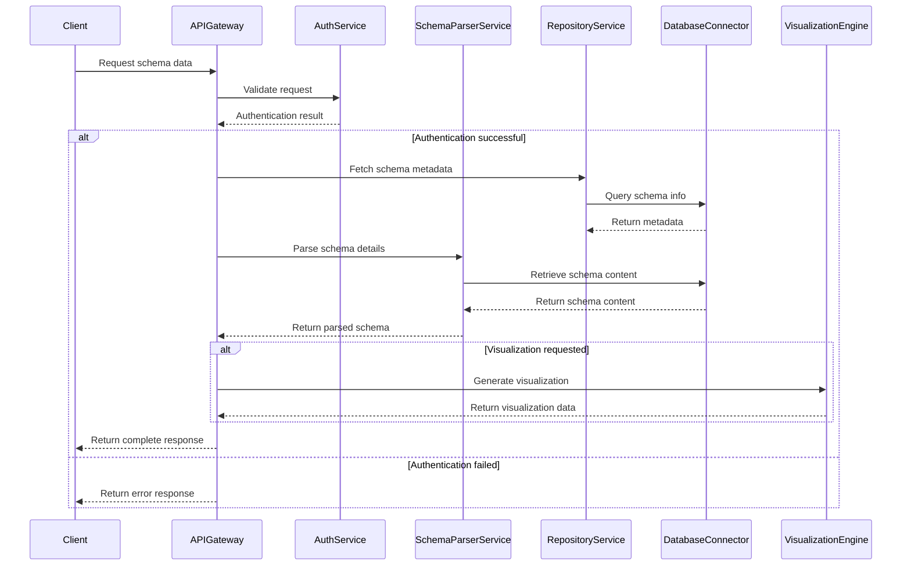
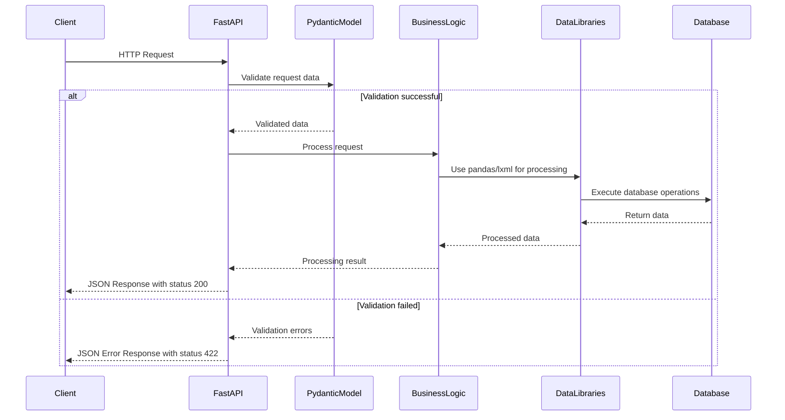
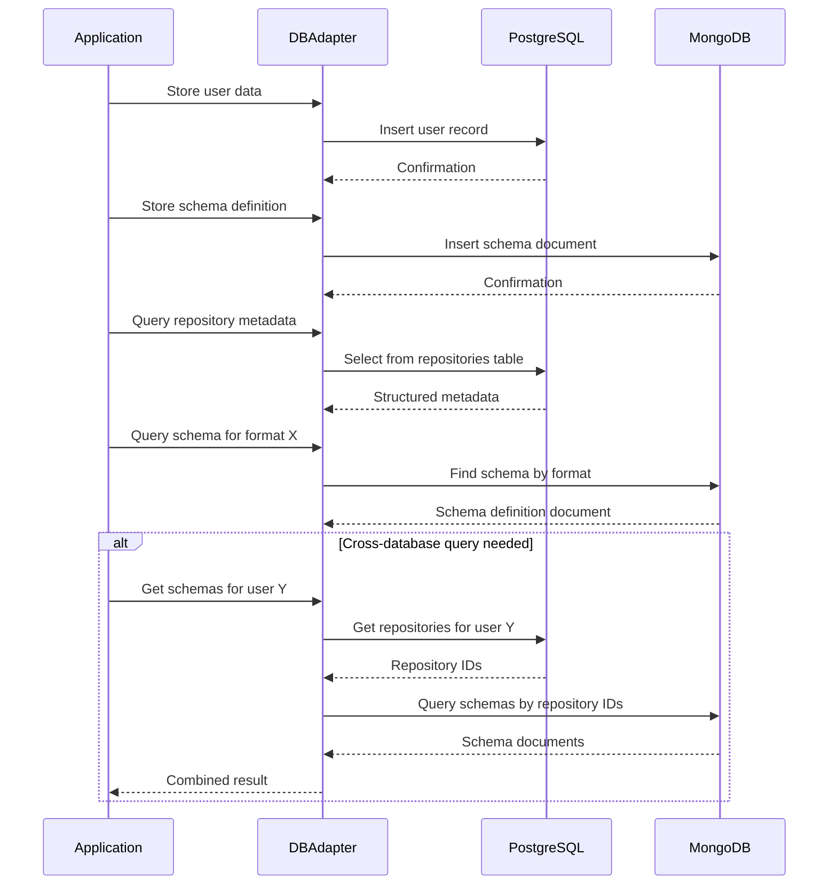
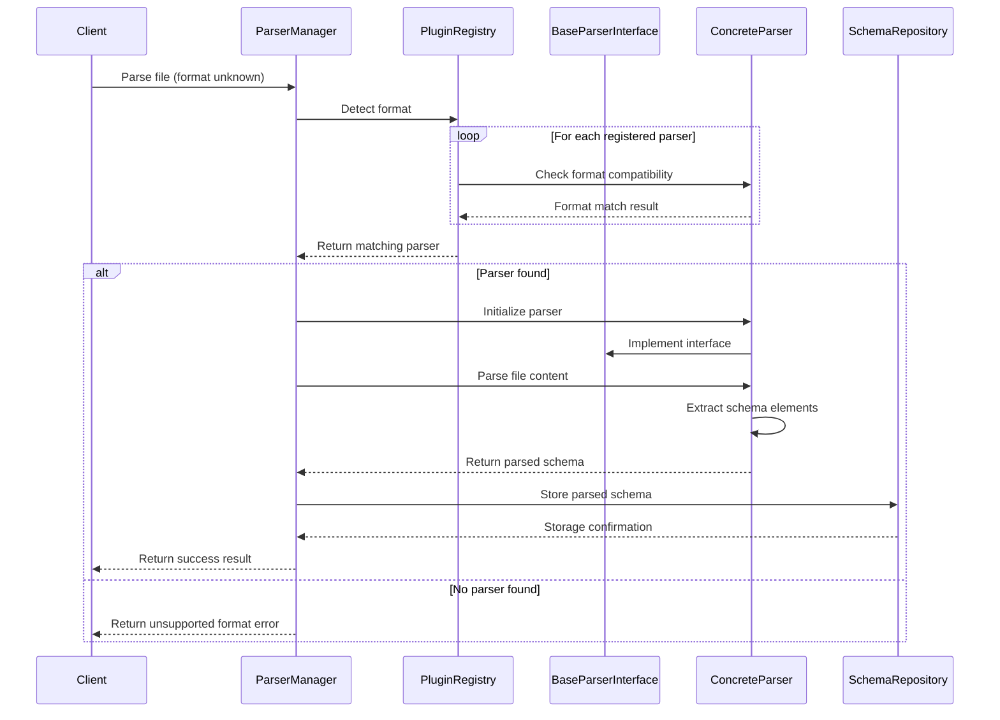
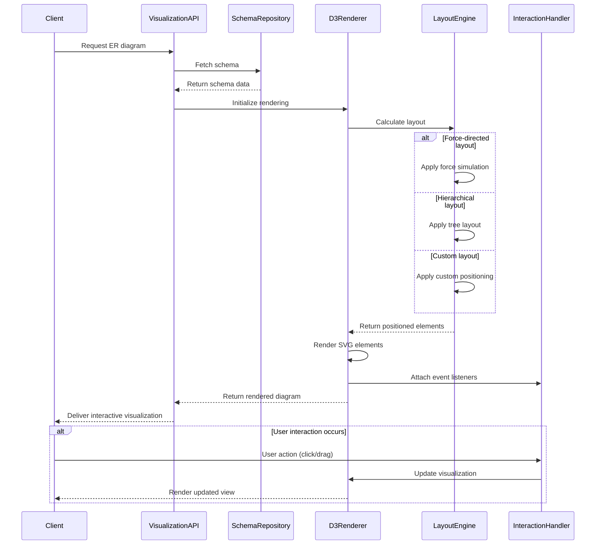
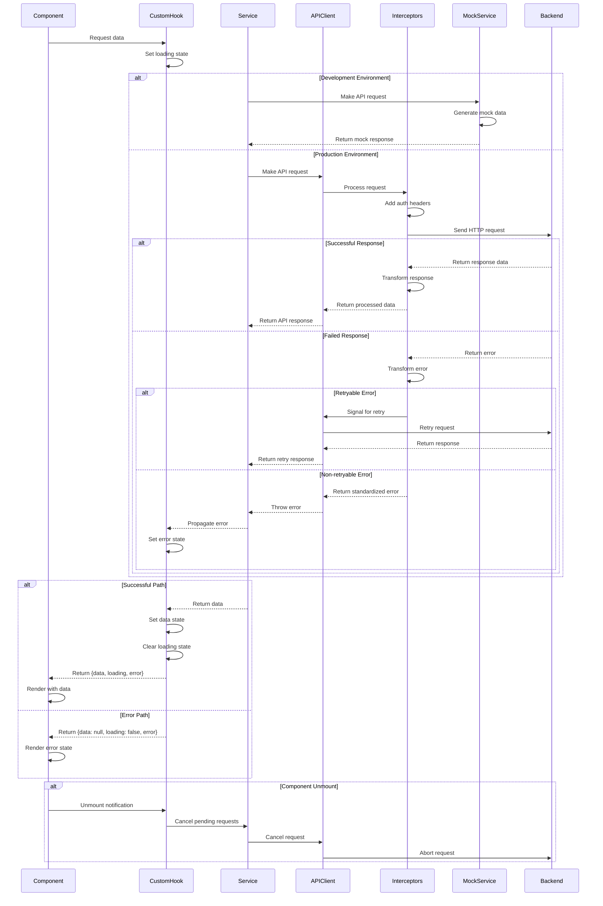
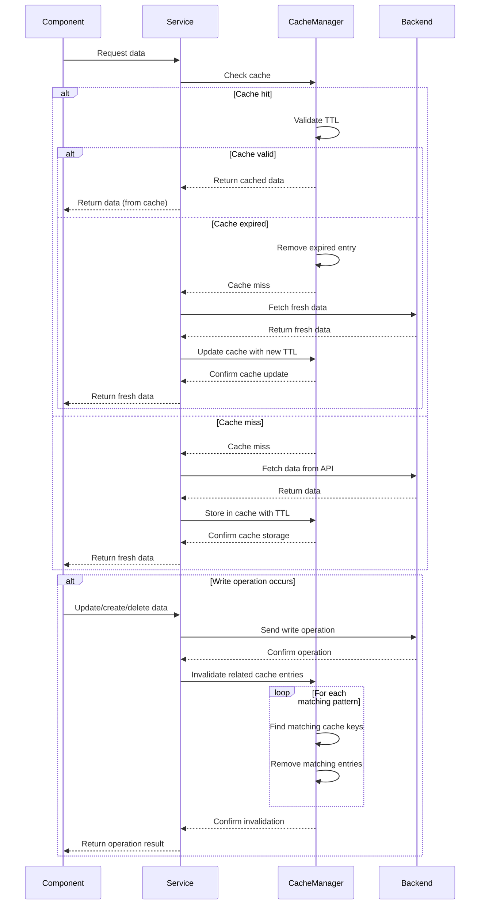
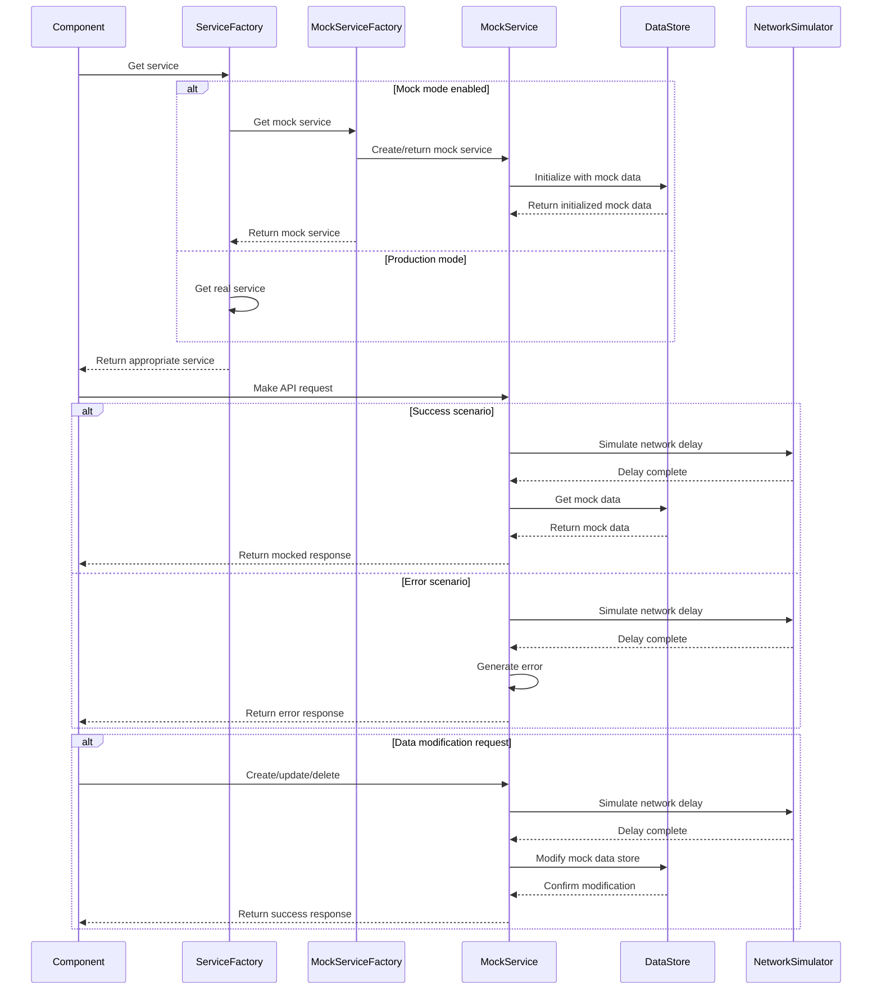
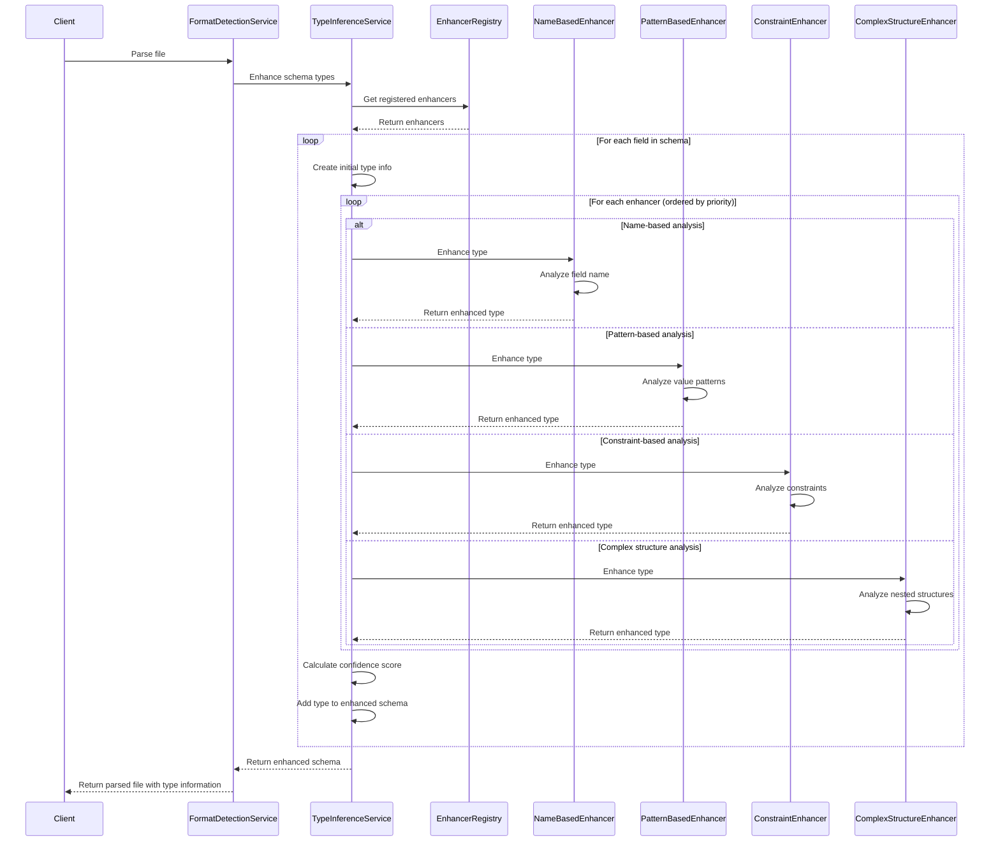

# Decision Journal: Data Dictionary Agency (DDA)
timestamp: 2025-04-27T21:30:00-07:00

## Active Decisions

### #ARCH_001: Microservices Architecture
- **Context**: Need a scalable, maintainable architecture for processing diverse data formats and handling large repositories
- **Options**: 
  - Monolithic application: Simpler to develop initially, but less scalable
  - Microservices: More complex setup, but better scalability and maintainability
  - Serverless: Good for sporadic workloads, but less suitable for long-running processes
- **Decision**: Implement as microservices using Python/FastAPI
- **Rationale**: 
  - Enables independent scaling of components (e.g., format parsers)
  - Allows for technology specialization per component
  - Supports incremental development and deployment
  - Better handles diverse processing requirements
- **Process Flow**:

  - This diagram illustrates the interaction flow between the microservices in the system architecture. The API Gateway serves as the central entry point, directing requests to the appropriate specialized services. Each service has distinct responsibilities, and they communicate with each other through well-defined interfaces. The diagram shows how a typical schema data request would be processed through authentication, repository access, schema parsing, and optional visualization, demonstrating the benefits of independent, specialized services working together to fulfill client requests.
- **Components**: All system components
- **Status**: Approved
- **Date**: 2025-04-14
- **Source**: Initial architecture planning

### #TECH_001: Python-Based Backend
- **Context**: Need to select primary backend technology for implementing the application
- **Options**:
  - Node.js: Good for asynchronous operations, but less robust for data processing
  - Python: Strong data processing libraries, good for parsing and analysis
  - Java: Enterprise-grade, but more verbose and slower development
  - Go: Fast performance, but fewer libraries for data formats
- **Decision**: Python 3.9+ with FastAPI for backend services
- **Rationale**:
  - Rich ecosystem of data processing libraries (pandas, lxml, etc.)
  - Strong support for all required data formats
  - FastAPI provides modern, async API capabilities with automatic documentation
  - Type hints improve code quality and maintenance
- **Process Flow**:

  - This diagram shows how the Python/FastAPI backend processes requests through a series of steps, leveraging Python's ecosystem. The sequence demonstrates FastAPI's built-in request validation using Pydantic models, which ensures data integrity before any business logic is executed. The business logic layer uses Python's powerful data processing libraries like pandas and lxml to efficiently manipulate and analyze data. The diagram highlights how the Python stack provides a clean, type-safe processing pipeline from request to response, with automatic error handling and validation.
- **Components**: All backend services
- **Status**: Approved
- **Date**: 2025-04-14
- **Source**: Initial technology stack planning

### #DB_001: Hybrid Database Approach
- **Context**: Need to store diverse data structures, schemas, and relationships
- **Options**:
  - Pure relational (PostgreSQL): Good for structured data, but less flexible
  - Pure document (MongoDB): Flexible for schema variations, but less querying power
  - Hybrid approach: Use both for respective strengths
  - Graph database: Good for relationships, but steep learning curve
- **Decision**: Hybrid approach with PostgreSQL for relational data and MongoDB for schema storage
- **Rationale**:
  - PostgreSQL handles structured data (user accounts, repository metadata)
  - MongoDB flexibly stores diverse schema definitions across formats
  - Combination leverages strengths of both database types
- **Process Flow**:

  - This diagram illustrates how the hybrid database approach works in practice. The application interacts with both PostgreSQL and MongoDB through a database adapter layer that directs different types of data to the appropriate database. Structured data like user accounts and repository metadata are stored in PostgreSQL, while flexible schema definitions are stored in MongoDB. The diagram also shows how cross-database queries are handled when data needs to be combined from both sources, highlighting the complementary nature of the two database systems and how they work together to provide a complete data storage solution.
- **Components**: #DB_SCHEMA, #DB_REPO, #DB_CONN
- **Status**: Approved
- **Date**: 2025-04-14
- **Source**: Database architecture planning

### #ARCH_002: Plugin Architecture for Format Parsers
- **Context**: Need to support 12 different data formats with extensibility
- **Options**:
  - Hard-coded parsers: Simple but inflexible
  - Plugin system: More complex but extensible
  - External services: Flexible but more operational complexity
- **Decision**: Implement a plugin architecture for format detection and parsing
- **Rationale**:
  - Enables adding new format parsers without changing core code
  - Allows independent development and testing of parsers
  - Supports loading parsers dynamically
  - Maintains clean separation of concerns
- **Process Flow**:

  - This diagram demonstrates how the plugin architecture dynamically discovers and uses the appropriate parser for an unknown data format. The ParserManager coordinates the process, while the PluginRegistry maintains a collection of available parsers. When a file needs parsing, the system checks each registered parser for compatibility, then uses the matching parser to process the file. The diagram highlights the extensibility of this approach - new parsers can be added to the registry without changing existing code, and each parser implements a common interface that ensures consistent behavior. The loop and alternate flows show how the system handles both successful parsing scenarios and cases where no compatible parser is found.
- **Components**: #FD_CORE, #FD_BASE
- **Status**: Approved
- **Date**: 2025-04-14
- **Source**: Format detection framework design

### #TECH_002: D3.js for Visualizations
- **Context**: Need to generate interactive ER diagrams with multiple layout options
- **Options**:
  - D3.js: Highly customizable, powerful, but complex
  - Cytoscape.js: Focused on graph visualization, easier API
  - GoJS: Commercial, feature-rich, but licensing costs
  - Custom solution: Maximum control but high development effort
- **Decision**: Use D3.js for visualization rendering
- **Rationale**:
  - Industry standard for data visualizations
  - High flexibility for custom layouts and interactions
  - Strong community support and documentation
  - Can be extended with additional libraries for specific needs
- **Process Flow**:

  - This diagram illustrates the visualization rendering process using D3.js. When a client requests an ER diagram, the system fetches the schema data and passes it to the D3Renderer component. The LayoutEngine calculates the appropriate positioning based on the selected layout type (force-directed, hierarchical, or custom), and the D3Renderer creates the SVG elements and attaches event listeners for interactive behavior. The diagram highlights D3.js's flexibility in supporting multiple layout algorithms and its robust handling of user interactions like clicking and dragging, which dynamically update the visualization. This sequence demonstrates why D3.js is the right choice for creating complex, interactive ER diagrams with multiple layout options.
- **Components**: #VE_RENDER, #VE_LAYOUT
- **Status**: Approved
- **Date**: 2025-04-14
- **Source**: Visualization engine planning

### #UI_002: API Client Architecture
- **Context**: Need to implement a robust system for frontend-backend communication with consistent patterns
- **Options**:
  - Direct API calls: Simple but lacks error handling and results in duplicated code
  - Individual service classes: Better organization but potential inconsistency
  - Centralized client with service layer: More complex setup, but better maintainability
  - Third-party API clients: Dependency on external libraries and potential lock-in
- **Decision**: Implement centralized API client architecture with Axios, services layer, and custom hooks
- **Rationale**:
  - Provides consistent error handling and request processing across all API calls
  - Centralizes configuration and authentication management
  - Enables request cancellation to prevent memory leaks and race conditions
  - Supports automatic retry for transient failures
  - Abstracts API complexity from UI components through custom hooks
  - Facilitates testing with mock services for development
- **Process Flow**:

  - This diagram illustrates the complete API client architecture flow from component to backend and back. The sequence shows how a component uses a custom hook to access a service, which then communicates with the backend through the centralized API client. The diagram highlights key features like request/response interceptors for header management and data transformation, environment-based switching between real and mock services, automatic retry for transient errors, standardized error handling, and request cancellation on component unmount. This architecture provides a robust foundation for all frontend-backend communication in the application.
- **Components**: #UI_API_CLIENT, #UI_REPO_SERVICE, #UI_SCHEMA_SERVICE, #UI_FORMAT_SERVICE, #UI_API_HOOK
- **Status**: Approved
- **Date**: 2025-04-27
- **Source**: API Client Architecture implementation (SUBTASK_002.2.1)

### #UI_003: Advanced Caching System
- **Context**: Need to optimize frontend performance, reduce network load, and improve user experience
- **Options**:
  - No caching: Simple implementation but poor performance
  - Browser-level caching: Limited control and granularity
  - Basic in-memory caching: Better control but limited invalidation capability
  - Advanced caching with TTL and pattern-based invalidation: More complex but comprehensive
  - Service worker caching: Good for offline support but complex implementation
- **Decision**: Implement advanced caching system with TTL and pattern-based invalidation
- **Rationale**:
  - Significantly reduces API calls for frequently accessed data
  - Configurable TTL values allow data freshness control
  - Pattern-based invalidation ensures related cache entries are cleared together
  - Improves perceived performance and reduces server load
  - Handles edge cases like update operations and stale data appropriately
- **Process Flow**:

  - This diagram illustrates the advanced caching system with TTL-based expiration and pattern-based invalidation. When a component requests data, the service first checks the cache manager. On a cache hit, the TTL is validated to ensure the data is still fresh. If valid, the cached data is returned without an API call; if expired, fresh data is fetched from the backend and the cache is updated. On a cache miss, data is fetched from the API and stored in the cache with a TTL. The diagram also shows how write operations trigger pattern-based invalidation, where all related cache entries matching specific patterns are identified and removed. This ensures that after data modifications, subsequent reads will fetch fresh data rather than serving stale cached values.
- **Components**: #UI_API_CLIENT, #UI_CACHE
- **Status**: Approved
- **Date**: 2025-04-27
- **Source**: Service Layer implementation (SUBTASK_002.2)

### #UI_004: Mock Service Architecture
- **Context**: Need a reliable development and testing environment that works without backend connectivity
- **Options**:
  - Hardcoded mock data: Simple but not flexible
  - Individual mock implementations: Lacks consistency across services
  - Centralized mock service layer: More setup but better maintainability
  - Third-party mocking libraries: External dependency and potential integration issues
- **Decision**: Implement a centralized mock service layer with realistic test data and configurable behaviors
- **Rationale**:
  - Enables offline development without backend dependency
  - Provides consistent mocking strategy across all services
  - Offers configurable behaviors like network delays and error scenarios
  - Facilitates testing of edge cases and error handling
  - Simplifies automated testing
- **Process Flow**:

  - This diagram illustrates the mock service architecture designed for development and testing environments. When a component requests a service, the ServiceFactory determines whether to return a real or mock service based on the current mode. In mock mode, the MockServiceFactory creates specialized mock services that interact with a DataStore containing realistic test data. The diagram shows how mock services simulate realistic API behavior, including configurable network delays and both success and error scenarios. This architecture enables development and testing to proceed without a backend dependency while maintaining a consistent interface with the real services. It also facilitates testing of edge cases and error handling by allowing precise control over the mock responses.
- **Components**: #UI_MOCK_SERVICE, #UI_SERVICE_FACTORY
- **Status**: Approved
- **Date**: 2025-04-27
- **Source**: Service Layer implementation (SUBTASK_002.2)

### #FD_001: Confidence-Based Type Inference System
- **Context**: Need accurate type detection across multiple data formats with varying type systems
- **Options**:
  - Single-pass type detection: Simple but limited accuracy
  - Multiple specialized type enhancers: More complex but higher accuracy
  - Machine learning-based type detection: Complex, requires training data
- **Decision**: Implement plugin-based architecture with multiple specialized enhancers
- **Rationale**:
  - Allows targeted approaches for different inference methods
  - Enables combining multiple signals for higher confidence
  - Provides detailed rationale for type decisions
  - Maintains extensibility for future enhancement methods
- **Process Flow**:

  - This diagram illustrates the confidence-based type inference system with multiple specialized enhancers. When a file is parsed, the FormatDetectionService requests type enhancement from the TypeInferenceService. For each field in the schema, the TypeInferenceService applies a series of enhancers in order of priority. Each enhancer analyzes the field from a different perspective: name patterns, value patterns, constraints, and complex structures. The type information is progressively enhanced with each step, and a confidence score is calculated based on the combined signals. This approach allows for accurate type inference across different formats by leveraging multiple sources of information and providing detailed confidence metrics for each type decision.
- **Components**: #FD_TYPEINF, #FD_CORE
- **Status**: Approved
- **Date**: 2025-04-23
- **Source**: Enhanced Type Inference System implementation

## Historical Decisions
None yet, as the project is just starting.
