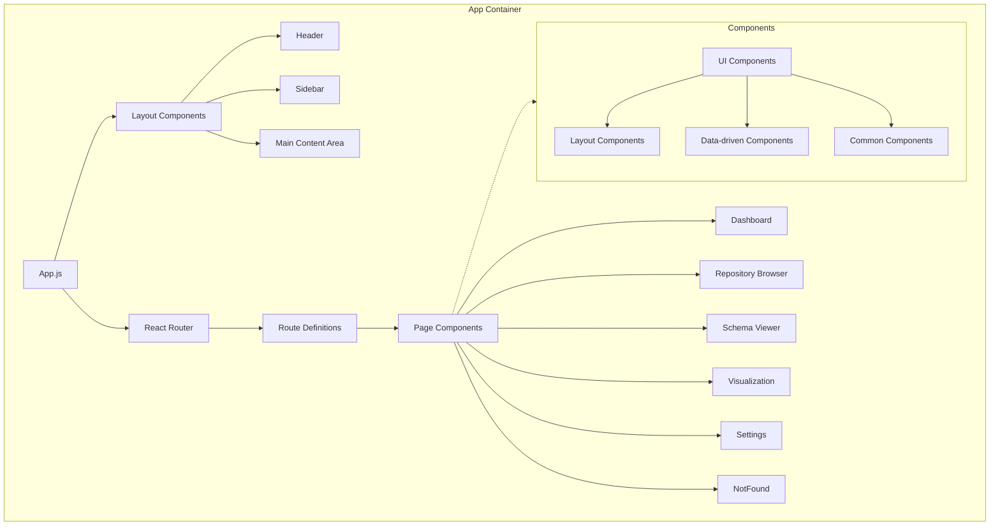
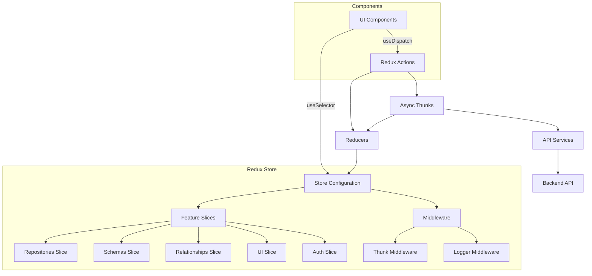
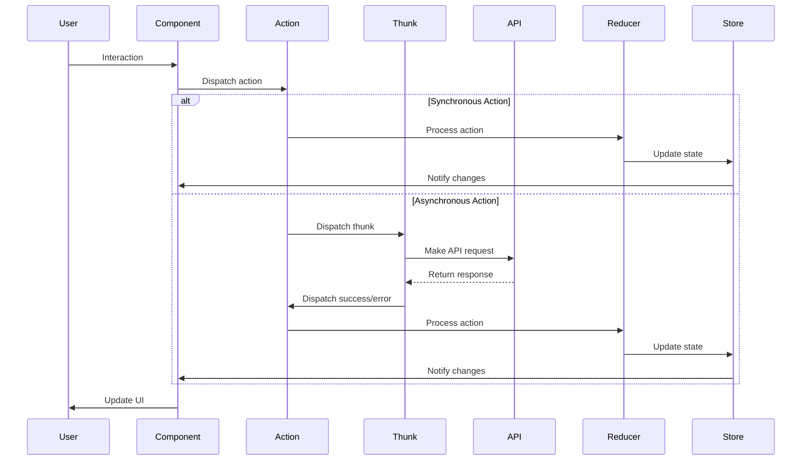

# System Patterns

This document outlines the architectural patterns, design principles, and conventions used throughout the Data Dictionary Agency.

## UI Patterns

### Component Architecture
The UI follows a component-based architecture using React:



### State Management
Redux is used for state management with a slice-based organization:



### Data Flow
The application follows a unidirectional data flow pattern:



## Backend Patterns

### Repository Pattern
Data access logic is encapsulated in repository classes:

```python
class SchemaRepository:
    def __init__(self, db_session):
        self.db_session = db_session
        
    def get_by_id(self, schema_id):
        return self.db_session.query(Schema).filter(Schema.id == schema_id).first()
        
    def get_all(self):
        return self.db_session.query(Schema).all()
        
    def create(self, schema_data):
        schema = Schema(**schema_data)
        self.db_session.add(schema)
        self.db_session.commit()
        return schema
```

### Service Layer
Business logic is contained in service classes:

```python
class SchemaService:
    def __init__(self, schema_repo, relationship_repo):
        self.schema_repo = schema_repo
        self.relationship_repo = relationship_repo
        
    def detect_relationships(self, schema_id):
        schema = self.schema_repo.get_by_id(schema_id)
        if not schema:
            raise EntityNotFoundError("Schema not found")
            
        other_schemas = self.schema_repo.get_all()
        detector = RelationshipDetector()
        relationships = detector.detect(schema, other_schemas)
        
        for rel in relationships:
            self.relationship_repo.create(rel)
            
        return relationships
```

### Strategy Pattern
Format detection leverages the strategy pattern:

```python
class FormatDetector:
    def __init__(self):
        self.strategies = {}
        
    def register_strategy(self, format_name, strategy):
        self.strategies[format_name] = strategy
        
    def detect(self, content):
        results = {}
        for name, strategy in self.strategies.items():
            confidence = strategy.detect(content)
            if confidence > 0:
                results[name] = confidence
                
        return results
```

## UI Design Patterns

### Responsive Layout
The application uses a responsive layout approach:

```jsx
// Responsive grid example
<SimpleGrid columns={{ base: 1, md: 2, lg: 4 }} spacing={5}>
  <Card>Content 1</Card>
  <Card>Content 2</Card>
  <Card>Content 3</Card>
  <Card>Content 4</Card>
</SimpleGrid>
```

### Component Composition
UI components are composed from smaller, reusable components:

```jsx
// Component composition example
const DashboardCard = ({ title, children, ...props }) => (
  <Card {...props}>
    <CardHeader>
      <Heading size="md">{title}</Heading>
    </CardHeader>
    <CardBody>
      {children}
    </CardBody>
  </Card>
);

// Usage
const Dashboard = () => (
  <Box>
    <DashboardCard title="Statistics">
      <StatGroup>
        <Stat name="Repositories" value={5} />
        <Stat name="Schemas" value={42} />
      </StatGroup>
    </DashboardCard>
  </Box>
);
```

### Container/Presentation Pattern
Components are separated into container (smart) and presentation (dumb) components:

```jsx
// Container component
const RepositoryListContainer = () => {
  const dispatch = useDispatch();
  const { repositories, status } = useSelector(state => state.repositories);
  
  useEffect(() => {
    dispatch(fetchRepositories());
  }, [dispatch]);
  
  return (
    <RepositoryList 
      repositories={repositories} 
      isLoading={status === 'loading'} 
    />
  );
};

// Presentation component
const RepositoryList = ({ repositories, isLoading }) => {
  if (isLoading) {
    return <Spinner />;
  }
  
  return (
    <VStack spacing={4} align="stretch">
      {repositories.map(repo => (
        <RepositoryItem key={repo.id} repository={repo} />
      ))}
    </VStack>
  );
};
```

## Data Processing Patterns

### Pipeline Pattern
Data processing uses a pipeline approach:

```python
class ProcessingPipeline:
    def __init__(self):
        self.steps = []
        
    def add_step(self, step):
        self.steps.append(step)
        
    def process(self, data):
        result = data
        for step in self.steps:
            result = step.process(result)
        return result
```

### Observer Pattern
The system uses observers for event notification:

```python
class EventEmitter:
    def __init__(self):
        self.listeners = {}
        
    def on(self, event, callback):
        if event not in self.listeners:
            self.listeners[event] = []
        self.listeners[event].append(callback)
        
    def emit(self, event, *args, **kwargs):
        if event in self.listeners:
            for callback in self.listeners[event]:
                callback(*args, **kwargs)
```

## Testing Patterns

### Unit Testing
Unit tests focus on individual functions and components:

```jsx
// React component test example
describe('RepositoryItem', () => {
  it('renders repository name', () => {
    const repo = { id: 1, name: 'Test Repo', description: 'Test description' };
    render(<RepositoryItem repository={repo} />);
    expect(screen.getByText('Test Repo')).toBeInTheDocument();
  });
});
```

```python
# Python unit test example
def test_schema_detection():
    detector = SchemaDetector()
    result = detector.detect(json_content)
    assert result.format == 'json'
    assert result.confidence > 0.8
```

### Integration Testing
Integration tests verify the interaction between components:

```python
def test_relationship_detection_service():
    # Setup test database
    db = setup_test_db()
    schema_repo = SchemaRepository(db)
    rel_repo = RelationshipRepository(db)
    
    # Create test schemas
    schema1 = schema_repo.create({'name': 'users', 'content': '...'})
    schema2 = schema_repo.create({'name': 'orders', 'content': '...'})
    
    # Test service
    service = SchemaService(schema_repo, rel_repo)
    relationships = service.detect_relationships(schema1.id)
    
    # Assertions
    assert len(relationships) > 0
    assert relationships[0].source_schema_id == schema1.id
    assert relationships[0].target_schema_id == schema2.id
```

## Error Handling Patterns

### Try-Except Pattern
Backend code uses structured exception handling:

```python
def process_schema(schema_id):
    try:
        schema = schema_repository.get_by_id(schema_id)
        if not schema:
            raise EntityNotFoundError(f"Schema {schema_id} not found")
            
        result = schema_processor.process(schema)
        return result
    except EntityNotFoundError as e:
        logger.warning(f"Entity not found: {str(e)}")
        raise
    except ProcessingError as e:
        logger.error(f"Processing error: {str(e)}")
        raise
    except Exception as e:
        logger.exception(f"Unexpected error: {str(e)}")
        raise UnexpectedError(f"An unexpected error occurred: {str(e)}")
```

### Async/Await Pattern
Frontend code uses async/await for asynchronous operations:

```jsx
const fetchData = async () => {
  try {
    setLoading(true);
    const response = await api.getRepositories();
    setRepositories(response.data);
    setError(null);
  } catch (err) {
    setError(err.message || 'Failed to fetch repositories');
    setRepositories([]);
  } finally {
    setLoading(false);
  }
};
```

## Security Patterns

### Authentication Middleware
API endpoints are protected by authentication middleware:

```python
@app.middleware("http")
async def authenticate(request, call_next):
    if request.url.path in PUBLIC_PATHS:
        return await call_next(request)
        
    auth_header = request.headers.get("Authorization")
    if not auth_header or not auth_header.startswith("Bearer "):
        return JSONResponse(
            status_code=401, 
            content={"detail": "Authentication required"}
        )
        
    token = auth_header.replace("Bearer ", "")
    try:
        payload = jwt.decode(token, SECRET_KEY, algorithms=["HS256"])
        request.state.user = payload
    except jwt.PyJWTError:
        return JSONResponse(
            status_code=401, 
            content={"detail": "Invalid authentication token"}
        )
        
    return await call_next(request)
```

### RBAC (Role-Based Access Control)
Access control is managed through user roles:

```python
def require_role(role):
    def decorator(func):
        @wraps(func)
        async def wrapper(request, *args, **kwargs):
            user = request.state.user
            if user["role"] not in [role, "admin"]:
                return JSONResponse(
                    status_code=403,
                    content={"detail": "Insufficient permissions"}
                )
            return await func(request, *args, **kwargs)
        return wrapper
    return decorator
