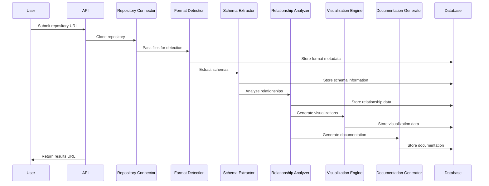

# System Patterns: Data Dictionary Agency (DDA)
timestamp: 2025-04-24T21:13:00-07:00

## Architecture Overview

The DDA application follows a modular microservices architecture with the following key components:

```sequenceDiagram
    participant User
    participant WA as Web Application
    participant API as API Gateway
    participant RC as Repository Connector
    participant GH as GitHub API
    participant FD as Format Detection
    participant RA as Relationship Analysis
    participant VE as Visualization Engine
    participant DG as Documentation Generator
    participant DB as Database
    participant Cache as Cache System
    
    User->>WA: Access application
    WA->>API: Route request
    
    %% Repository operations
    API->>RC: Send repository request
    RC->>GH: Fetch repository data
    GH-->>RC: Return repository content
    RC->>DB: Store repository data
    RC->>Cache: Cache repository metadata
    
    %% Format detection flow
    RC->>FD: Send files for detection
    FD->>DB: Store format metadata
    FD->>Cache: Cache format information
    
    %% Analysis and visualization
    FD->>RA: Forward extracted schemas
    RA->>DB: Store relationship data
    RA->>Cache: Cache analysis results
    RA->>VE: Send for visualization
    RA->>DG: Send for documentation
    
    %% Final results processing
    VE->>DB: Store visualization data
    VE->>Cache: Cache rendering info
    DG->>DB: Store documentation
    DG->>Cache: Cache documentation
    
    %% Return to user
    VE-->>API: Return visualizations
    DG-->>API: Return documentation
    API-->>WA: Return complete results
    WA-->>User: Display results
```

## Core Components

### 1. Repository Connector Module
- **Purpose**: Access GitHub repositories and extract structured data files
- **Patterns**: Adapter Pattern, Factory Method
- **Responsibilities**:
  - GitHub API integration
  - Repository cloning and management
  - Path traversal and file extraction
  - Format detection coordination

### 2. Format Detection Engine
- **Purpose**: Identify file formats and extract schema information
- **Patterns**: Strategy Pattern, Plugin Architecture
- **Responsibilities**:
  - Multi-format analysis with extensible parser plugins
  - Format detection with high accuracy
  - Schema extraction from various formats
  - Type inference and constraint detection

### 3. Relationship Analysis Service
- **Purpose**: Discover relationships between data structures
- **Patterns**: Observer Pattern, Composite Pattern
- **Responsibilities**:
  - Cross-format relationship detection
  - Schema comparison algorithms
  - Relationship confidence scoring
  - Cardinality determination

### 4. Visualization Engine
- **Purpose**: Generate interactive ER diagrams
- **Patterns**: Builder Pattern, Decorator Pattern
- **Responsibilities**:
  - ER diagram generation
  - Interactive rendering
  - Layout optimization algorithms
  - Visualization export

### 5. Documentation Generator
- **Purpose**: Create comprehensive schema documentation
- **Patterns**: Template Method, Chain of Responsibility
- **Responsibilities**:
  - Schema-to-documentation transformation
  - Template management
  - Multi-format export processing
  - Example generation

### 6. Web Application Layer
- **Purpose**: Provide user interface and API gateway
- **Patterns**: MVC Pattern, Mediator Pattern
- **Responsibilities**:
  - User interface components
  - API gateway for service coordination
  - Real-time processing status updates
  - Result visualization and interaction

### 7. Persistence Layer
- **Purpose**: Store analysis results and user preferences
- **Patterns**: Repository Pattern, Unit of Work
- **Responsibilities**:
  - Analysis results storage
  - User preferences and history
  - Caching system for performance optimization
  - Version management

## Data Processing Pipeline



## Key Design Patterns

### Plugin Architecture
The Format Detection Engine uses a plugin architecture to support multiple file formats:

```sequenceDiagram
    participant Client
    participant FD as FormatDetector
    participant Registry
    participant JP as JSONParser
    participant CP as CSVParser
    participant XP as XMLParser
    participant GQL as GraphQLParser
    participant JSP as JSONSchemaParser
    
    %% Registration process
    Note over FD,Registry: Initialization Phase
    FD->>Registry: Create parser registry
    Client->>FD: registerParser(JSONParser)
    FD->>Registry: Add JSONParser
    Client->>FD: registerParser(CSVParser)
    FD->>Registry: Add CSVParser
    Client->>FD: registerParser(XMLParser)
    FD->>Registry: Add XMLParser
    Client->>FD: registerParser(GraphQLParser)
    FD->>Registry: Add GraphQLParser
    Client->>FD: registerParser(JSONSchemaParser)
    FD->>Registry: Add JSONSchemaParser
    
    %% Detection process
    Note over FD,JSP: Detection Phase
    Client->>FD: detectFormat(file)
    FD->>Registry: Get all parsers
    Registry-->>FD: Return parser list
    
    %% Try each parser
    FD->>JP: canParse(file)
    alt Can parse JSON
        JP-->>FD: true
        FD->>JP: parseSchema(file)
        JP-->>FD: Return JSON schema
    else Cannot parse
        JP-->>FD: false
        FD->>CP: canParse(file)
        alt Can parse CSV
            CP-->>FD: true
            FD->>CP: parseSchema(file)
            CP-->>FD: Return CSV schema
        else Cannot parse
            CP-->>FD: false
            FD->>XP: canParse(file)
            alt Can parse XML
                XP-->>FD: true
                FD->>XP: parseSchema(file)
                XP-->>FD: Return XML schema
            else Cannot parse XML
                XP-->>FD: false
                FD->>GQL: canParse(file)
                alt Can parse GraphQL
                    GQL-->>FD: true
                    FD->>GQL: parseSchema(file)
                    GQL-->>FD: Return GraphQL schema
                else Cannot parse GraphQL
                    GQL-->>FD: false
                    FD->>JSP: canParse(file)
                    alt Can parse JSON Schema
                        JSP-->>FD: true
                        FD->>JSP: parseSchema(file)
                        JSP-->>FD: Return JSON Schema
                    else Cannot parse any format
                        JSP-->>FD: false
                        FD-->>Client: Format not supported
                    end
                end
            end
        end
    end
    
    %% Return result to client
    FD-->>Client: Return detected schema
```

### Enhanced Format Parser Pattern

The implementation for schema format parsers follows a common pattern that provides consistent behavior across different format types:

```sequenceDiagram
    participant Client
    participant Parser as FormatParser
    participant TypeMapper
    participant ConstraintExtractor
    participant SchemaBuilder
    
    %% Format detection
    Client->>Parser: canParse(filename, content)
    Parser->>Parser: Check file extension
    Parser->>Parser: Check content indicators
    Parser-->>Client: Return format detection result
    
    %% Schema parsing
    Client->>Parser: parseSchema(filename, content)
    
    %% Parse content based on format
    Parser->>Parser: Parse content structure
    
    %% Extract and map types
    Parser->>TypeMapper: mapTypes(fieldDefinitions)
    TypeMapper->>TypeMapper: Apply format-specific mappings
    TypeMapper->>TypeMapper: Apply type inference enhancements
    TypeMapper->>TypeMapper: Calculate type confidence
    TypeMapper-->>Parser: Return normalized types
    
    %% Extract constraints
    Parser->>ConstraintExtractor: extractConstraints(fieldDefinitions)
    ConstraintExtractor->>ConstraintExtractor: Identify format-specific constraints
    ConstraintExtractor->>ConstraintExtractor: Process validation rules
    ConstraintExtractor-->>Parser: Return constraint collection
    
    %% Build schema representation
    Parser->>SchemaBuilder: createSchema(fields, types, constraints)
    SchemaBuilder->>SchemaBuilder: Create field objects
    SchemaBuilder->>SchemaBuilder: Assign primary keys
    SchemaBuilder->>SchemaBuilder: Set metadata
    SchemaBuilder-->>Parser: Return schema object
    
    %% Return complete schema
    Parser-->>Client: Return complete schema details
```

This pattern has been successfully implemented in both the GraphQL schema parser and JSON Schema parser, allowing for:

1. Consistent interface across all format parsers
2. Specialized type mapping for each format
3. Format-specific constraint extraction
4. Robust error handling
5. Precise schema extraction with confidence scoring
6. Support for nested structures and complex types

### Strategy Pattern
Used for implementing different relationship detection algorithms:

```sequenceDiagram
    participant Client
    participant RD as RelationshipDetector
    participant NBS as NameBasedStrategy
    participant TBS as TypeBasedStrategy
    participant CBS as ContentBasedStrategy
    participant Results
    
    %% Strategy selection and initialization
    Note over RD,CBS: Strategy Configuration
    Client->>RD: Create detector with strategies
    RD->>NBS: Initialize strategy
    RD->>TBS: Initialize strategy
    RD->>CBS: Initialize strategy
    
    %% Relationship detection process
    Note over RD,Results: Detection Process
    Client->>RD: detectRelationships(schemas)
    
    %% Execute each strategy in sequence
    RD->>NBS: analyze(schemas)
    NBS->>NBS: Process based on naming conventions
    NBS-->>RD: Return name-based relationships
    
    RD->>TBS: analyze(schemas)
    TBS->>TBS: Process based on data types
    TBS-->>RD: Return type-based relationships
    
    RD->>CBS: analyze(schemas)
    CBS->>CBS: Process based on content patterns
    CBS-->>RD: Return content-based relationships
    
    %% Aggregate and score results
    RD->>RD: Combine and score relationships
    RD->>Results: Store relationship data
    
    %% Return final results
    RD-->>Client: Return consolidated relationships
```

### Observer Pattern
Used for progress tracking and real-time updates:

```sequenceDiagram
    participant Client
    participant PJ as ProcessingJob
    participant Registry
    participant WSO as WebSocketObserver
    participant LO as LoggingObserver
    participant User
    participant Logs
    
    %% Observer registration
    Note over PJ,Registry: Setup Phase
    Client->>PJ: Create processing job
    Client->>PJ: addObserver(WebSocketObserver)
    PJ->>Registry: Register WebSocketObserver
    Client->>PJ: addObserver(LoggingObserver)
    PJ->>Registry: Register LoggingObserver
    
    %% Processing with notifications
    Note over PJ,Logs: Processing Phase
    Client->>PJ: process()
    
    %% Job starts processing with multiple progress updates
    PJ->>PJ: Start processing
    PJ->>Registry: notifyProgress(10%)
    Registry->>WSO: update(10%)
    WSO->>User: Send real-time update
    Registry->>LO: update(10%)
    LO->>Logs: Log progress
    
    %% More processing steps with notifications
    PJ->>PJ: Continue processing
    PJ->>Registry: notifyProgress(50%)
    Registry->>WSO: update(50%)
    WSO->>User: Send real-time update
    Registry->>LO: update(50%)
    LO->>Logs: Log progress
    
    %% Job completion notification
    PJ->>PJ: Complete processing
    PJ->>Registry: notifyProgress(100%)
    Registry->>WSO: update(100%)
    WSO->>User: Send completion notice
    Registry->>LO: update(100%)
    LO->>Logs: Log completion
    
    %% Return results
    PJ-->>Client: Return processing results
```

## Performance Considerations

### Streaming Processing
For handling large files (>1GB):

```sequenceDiagram
    participant Client
    participant FS as FileStreamManager
    participant Chunker
    participant W1 as Worker1
    participant W2 as Worker2
    participant W3 as Worker3
    participant RA as ResultAggregator
    participant Results
    
    %% Initialize streaming process
    Client->>FS: processLargeFile(filePath)
    FS->>Chunker: createChunks(fileStream)
    
    %% Create chunks in parallel
    par Chunk processing
        Chunker->>W1: processChunk(chunk1)
        W1->>W1: Parse and transform data
        W1->>RA: submitResults(chunk1Results)
    and
        Chunker->>W2: processChunk(chunk2)
        W2->>W2: Parse and transform data
        W2->>RA: submitResults(chunk2Results)
    and
        Chunker->>W3: processChunk(chunk3)
        W3->>W3: Parse and transform data
        W3->>RA: submitResults(chunk3Results)
    end
    
    %% Aggregate results as they come in
    RA->>RA: Merge and validate results
    RA->>Results: Store combined results
    
    %% Return final output
    RA-->>FS: Return aggregated results
    FS-->>Client: Return complete processing results
```

### Distributed Processing
For large repositories (>5GB):

```sequenceDiagram
    participant Client
    participant MN as MasterNode
    participant W1 as WorkerNode1
    participant W2 as WorkerNode2
    participant W3 as WorkerNode3
    participant RA as RelationshipAnalyzer
    participant Results
    
    %% Initialize distributed processing
    Client->>MN: processLargeRepository(repoUrl)
    MN->>MN: Split repository into partitions
    
    %% Distribute work to worker nodes
    par Work distribution
        MN->>W1: processPartition(partition1)
        W1->>W1: Format detection
        W1->>W1: Schema extraction
        W1-->>MN: Return partition1Results
    and
        MN->>W2: processPartition(partition2)
        W2->>W2: Format detection
        W2->>W2: Schema extraction
        W2-->>MN: Return partition2Results
    and
        MN->>W3: processPartition(partition3)
        W3->>W3: Format detection
        W3->>W3: Schema extraction
        W3-->>MN: Return partition3Results
    end
    
    %% Process aggregated results
    MN->>MN: Combine worker results
    MN->>RA: analyzeRelationships(combinedSchemas)
    RA->>RA: Perform cross-schema analysis
    RA->>Results: Store relationship data
    
    %% Return complete results
    RA-->>MN: Return relationship analysis
    MN-->>Client: Return complete processing results
```

## Error Handling Strategy

The DDA implements a comprehensive error handling strategy:

```sequenceDiagram
    participant Client
    participant PJ as ProcessingJob
    participant ER as ErrorRegistry
    participant FC as FileComponent
    participant RC as RecoveryComponent
    participant UI as UserInterface
    
    %% Initialize processing with error handling
    Client->>PJ: process(repository)
    
    %% Process files with error detection
    PJ->>FC: processFile(file1)
    
    alt File processes successfully
        FC-->>PJ: Return successful result
    else Error encountered
        FC->>ER: registerError(file1, errorDetails)
        ER->>ER: Log detailed error information
        ER->>ER: Aggregate with similar errors
        FC-->>PJ: Return partial result
    end
    
    %% Continue processing despite errors
    PJ->>FC: processFile(file2)
    FC-->>PJ: Return successful result
    
    %% Process more files
    PJ->>FC: processFile(file3)
    alt Error threshold reached
        FC->>ER: checkErrorThreshold()
        ER-->>FC: Threshold exceeded
        FC->>RC: initiateRecovery(checkpointId)
        RC->>RC: Restore from last checkpoint
        RC-->>FC: Recovery complete
        FC->>FC: Resume processing with modified strategy
        FC-->>PJ: Return recovered results
    else Processing continues
        FC-->>PJ: Return successful result
    end
    
    %% Prepare results with error information
    PJ->>PJ: Consolidate available results
    PJ->>ER: getErrorSummary()
    ER-->>PJ: Return categorized errors
    
    %% Return results to client
    PJ-->>Client: Return partial results with errors
    Client->>UI: displayResults(results)
    Client->>UI: displayErrorSummary(errorSummary)
```

1. **Graceful Degradation**: Continue processing despite errors in individual files
2. **Detailed Error Reporting**: Capture line numbers, error types, and suggest fixes
3. **Partial Results**: Present available data even when analysis is incomplete
4. **Error Aggregation**: Group similar errors to prevent overwhelming users
5. **Recovery Mechanisms**: Implement checkpoint-based recovery for long-running processes

## Security Model

```sequenceDiagram
    participant User
    participant WA as WebApplication
    participant Auth as AuthService
    participant GH as GitHubAuth
    participant TS as TokenStorage
    participant API as APIGateway
    participant ACL as AccessControlLayer
    participant Svc as Services
    participant AL as AuditLogging
    
    %% Authentication flow
    User->>WA: Access application
    WA->>Auth: Redirect to authentication
    Auth->>GH: Initiate OAuth 2.0 flow
    GH->>User: Request GitHub permissions
    User->>GH: Grant permissions
    GH->>Auth: Return authorization code
    Auth->>GH: Exchange for access token
    GH-->>Auth: Return GitHub access token
    
    %% Token management
    Auth->>Auth: Generate JWT
    Auth->>TS: Store tokens securely
    Auth-->>WA: Return session with JWT
    WA-->>User: Authentication successful
    
    %% Secured API access
    User->>WA: Request protected resource
    WA->>API: Forward request with JWT
    API->>TS: Validate token
    TS-->>API: Token validation result
    
    %% Access control
    API->>ACL: Check authorization
    ACL->>ACL: Verify permissions
    ACL-->>API: Authorization result
    
    alt Authorized
        API->>Svc: Forward request
        Svc->>AL: Log access attempt (success)
        Svc->>Svc: Process request
        Svc-->>API: Return results
        API-->>WA: Return protected resource
        WA-->>User: Display results
    else Not authorized
        ACL-->>API: Access denied
        API->>AL: Log access attempt (denied)
        API-->>WA: Return access denied
        WA-->>User: Display access denied
    end
```

The security model ensures:
1. Secure GitHub API integration via OAuth 2.0
2. Repository access control respecting GitHub permissions
3. Data isolation between analyses
4. Protection of generated artifacts
5. Secure web interface with HTTPS, CSP, and XSS protection
6. API authentication using JWT
7. Comprehensive audit logging

## Technical Debt Management

```sequenceDiagram
    participant Dev as Developer
    participant CI as CISystem
    participant TC as TestCoverage
    participant SA as StaticAnalysis
    participant ADR as ArchitectureDecisions
    participant CR as CodeReview
    participant Perf as PerformanceMonitor
    
    %% Development and testing cycle
    Dev->>CI: Submit code changes
    CI->>TC: Run test suite
    TC->>TC: Verify >90% coverage
    TC-->>CI: Report test coverage
    
    %% Static analysis
    CI->>SA: Run code quality checks
    SA->>SA: Analyze complexity metrics
    SA->>SA: Check code style
    SA->>SA: Find potential bugs
    SA-->>CI: Report quality issues
    
    %% Architecture documentation
    alt Architecture change
        Dev->>ADR: Document decision
        ADR->>ADR: Record rationale and alternatives
        ADR->>ADR: Link to requirements
        ADR-->>Dev: Confirm documentation
    end
    
    %% Code review process
    CI-->>Dev: Report CI results
    Dev->>CR: Request code review
    CR->>CR: Review changes
    CR->>CR: Check for clean architecture
    CR->>CR: Verify separation of concerns
    CR-->>Dev: Provide feedback
    
    %% Periodic maintenance
    loop Every sprint
        Dev->>Perf: Run performance tests
        Perf->>Perf: Benchmark key operations
        Perf->>Perf: Compare to baseline
        Perf-->>Dev: Report performance metrics
        
        alt Performance degradation
            Dev->>Dev: Prioritize optimization
        end
        
        Dev->>Dev: Identify refactoring needs
        Dev->>Dev: Update API versioning
    end
```

To manage technical debt effectively, the DDA project will:

1. Implement comprehensive test coverage (>90%)
2. Use static analysis tools for code quality
3. Document architecture decisions with ADRs
4. Review and refactor code regularly
5. Maintain clean separation of concerns
6. Use explicit versioning for APIs and data structures
7. Conduct regular performance reviews
