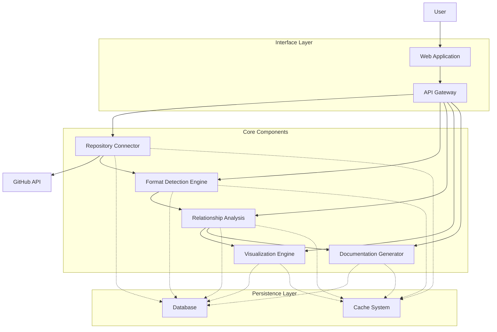
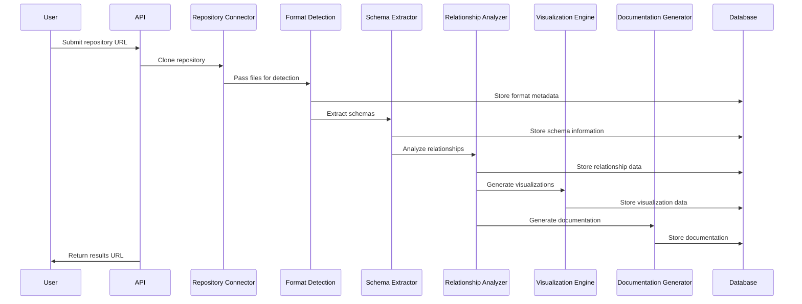
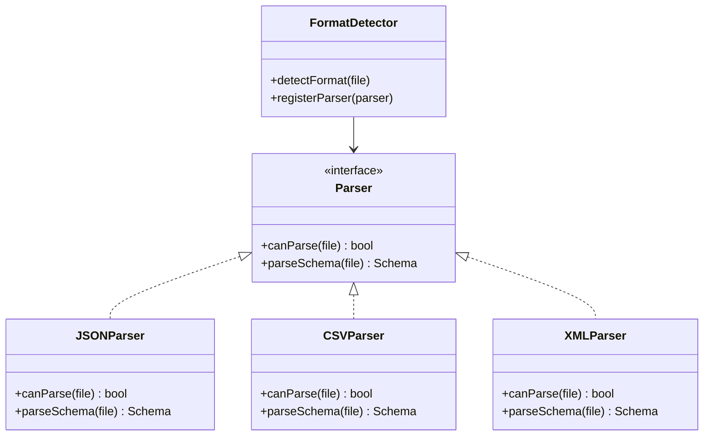
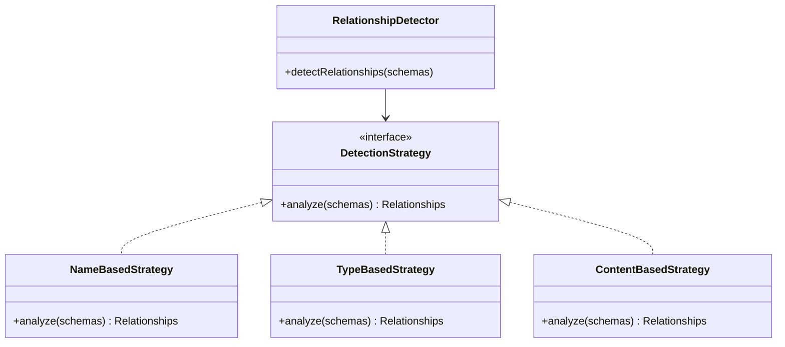
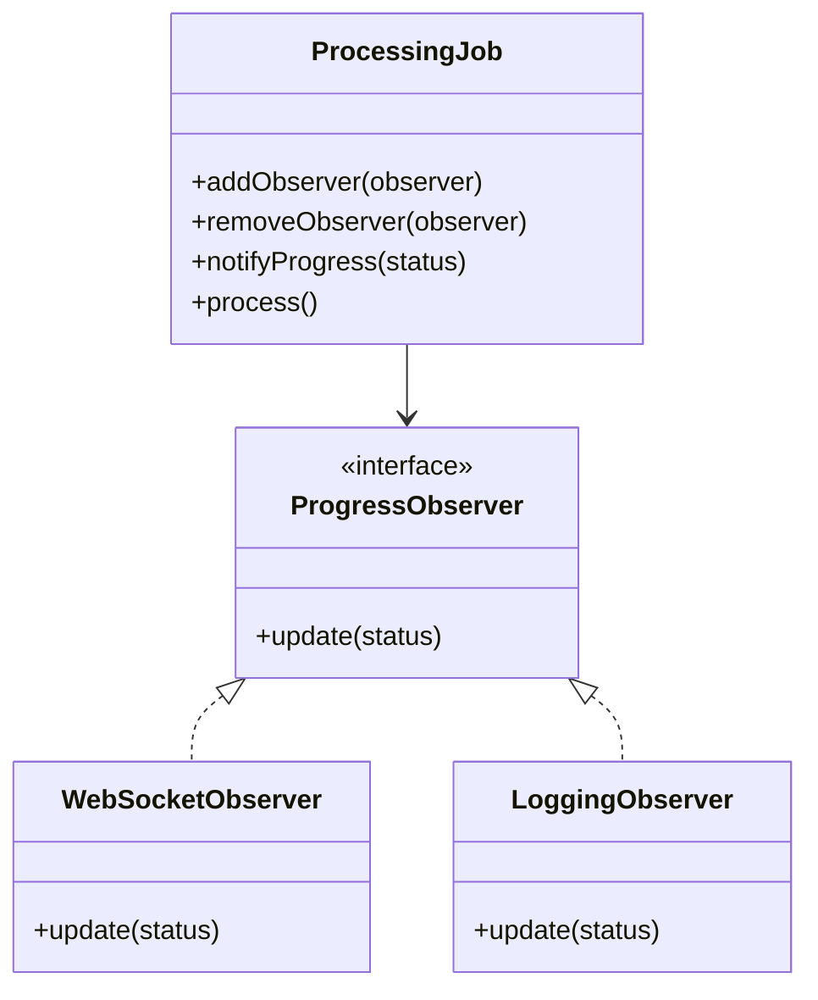
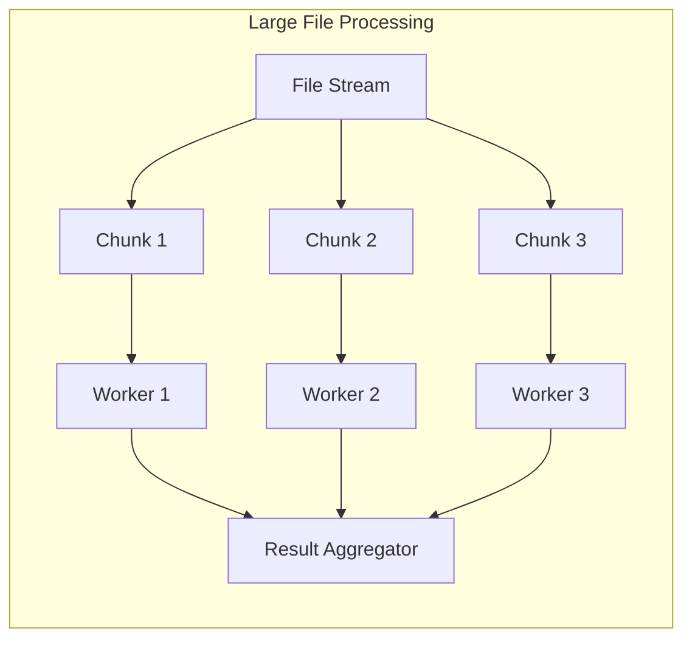
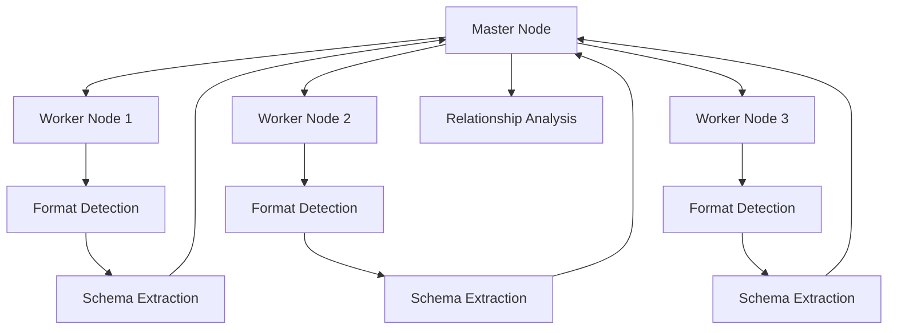
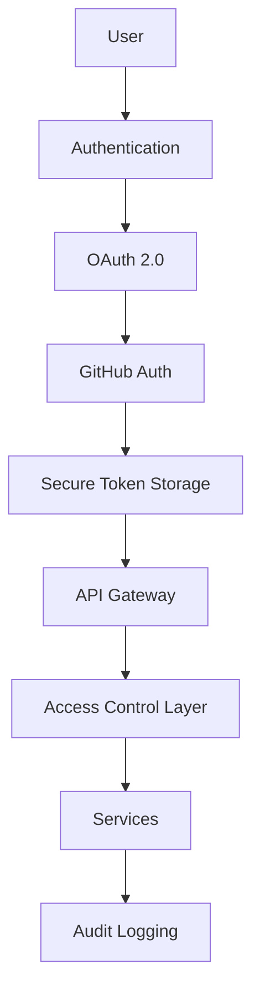

# System Patterns: Data Dictionary Agency (DDA)
timestamp: 2025-04-14T21:24:00-07:00

## Architecture Overview

The DDA application follows a modular microservices architecture with the following key components:

## Core Components

### 1. Repository Connector Module
- **Purpose**: Access GitHub repositories and extract structured data files
- **Patterns**: Adapter Pattern, Factory Method
- **Responsibilities**:
  - GitHub API integration
  - Repository cloning and management
  - Path traversal and file extraction
  - Format detection coordination

### 2. Format Detection Engine
- **Purpose**: Identify file formats and extract schema information
- **Patterns**: Strategy Pattern, Plugin Architecture
- **Responsibilities**:
  - Multi-format analysis with extensible parser plugins
  - Format detection with high accuracy
  - Schema extraction from various formats
  - Type inference and constraint detection

### 3. Relationship Analysis Service
- **Purpose**: Discover relationships between data structures
- **Patterns**: Observer Pattern, Composite Pattern
- **Responsibilities**:
  - Cross-format relationship detection
  - Schema comparison algorithms
  - Relationship confidence scoring
  - Cardinality determination

### 4. Visualization Engine
- **Purpose**: Generate interactive ER diagrams
- **Patterns**: Builder Pattern, Decorator Pattern
- **Responsibilities**:
  - ER diagram generation
  - Interactive rendering
  - Layout optimization algorithms
  - Visualization export

### 5. Documentation Generator
- **Purpose**: Create comprehensive schema documentation
- **Patterns**: Template Method, Chain of Responsibility
- **Responsibilities**:
  - Schema-to-documentation transformation
  - Template management
  - Multi-format export processing
  - Example generation

### 6. Web Application Layer
- **Purpose**: Provide user interface and API gateway
- **Patterns**: MVC Pattern, Mediator Pattern
- **Responsibilities**:
  - User interface components
  - API gateway for service coordination
  - Real-time processing status updates
  - Result visualization and interaction

### 7. Persistence Layer
- **Purpose**: Store analysis results and user preferences
- **Patterns**: Repository Pattern, Unit of Work
- **Responsibilities**:
  - Analysis results storage
  - User preferences and history
  - Caching system for performance optimization
  - Version management

## Data Processing Pipeline

## Key Design Patterns

### Plugin Architecture
The Format Detection Engine uses a plugin architecture to support multiple file formats:

### Strategy Pattern
Used for implementing different relationship detection algorithms:

### Observer Pattern
Used for progress tracking and real-time updates:

## Performance Considerations

### Streaming Processing
For handling large files (>1GB):

### Distributed Processing
For large repositories (>5GB):

## Error Handling Strategy

The DDA implements a comprehensive error handling strategy:

1. **Graceful Degradation**: Continue processing despite errors in individual files
2. **Detailed Error Reporting**: Capture line numbers, error types, and suggest fixes
3. **Partial Results**: Present available data even when analysis is incomplete
4. **Error Aggregation**: Group similar errors to prevent overwhelming users
5. **Recovery Mechanisms**: Implement checkpoint-based recovery for long-running processes

## Security Model

The security model ensures:
1. Secure GitHub API integration via OAuth 2.0
2. Repository access control respecting GitHub permissions
3. Data isolation between analyses
4. Protection of generated artifacts
5. Secure web interface with HTTPS, CSP, and XSS protection
6. API authentication using JWT
7. Comprehensive audit logging

## Technical Debt Management

To manage technical debt effectively, the DDA project will:

1. Implement comprehensive test coverage (>90%)
2. Use static analysis tools for code quality
3. Document architecture decisions with ADRs
4. Review and refactor code regularly
5. Maintain clean separation of concerns
6. Use explicit versioning for APIs and data structures
7. Conduct regular performance reviews
