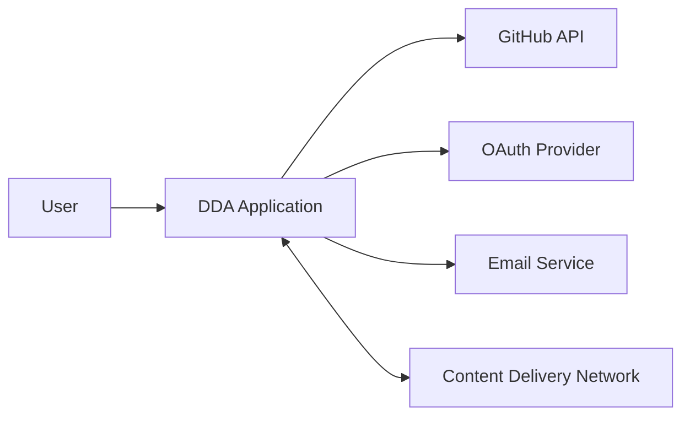

# Technology Context: Data Dictionary Agency (DDA)
timestamp: 2025-04-14T21:25:00-07:00

## Technology Stack

The DDA will be implemented using the following technology stack:

### Backend Services

| Component | Technology | Version | Purpose |
|-----------|------------|---------|---------|
| Primary Backend | Python | 3.9+ | Core processing logic, format parsing |
| API Gateway | FastAPI | 0.95+ | RESTful API endpoints, WebSocket support |
| Task Processing | Celery | 5.2+ | Asynchronous and distributed processing |
| Message Broker | Redis | 7.0+ | Queue management for Celery tasks |

### Data Processing

| Component | Technology | Version | Purpose |
|-----------|------------|---------|---------|
| Data Manipulation | Pandas | 2.0+ | Working with tabular data (CSV, Excel) |
| XML Processing | lxml | 4.9+ | XML parsing and schema extraction |
| JSON Processing | orjson | 3.8+ | High-performance JSON operations |
| SQL Parsing | sqlparse | 0.4+ | SQL DDL statement parsing |
| Parquet/Avro | PyArrow | 12.0+ | Apache Parquet and Avro support |
| Protocol Buffers | protobuf | 4.21+ | Proto file parsing |
| GraphQL | graphql-core | 3.2+ | GraphQL schema parsing |

### Frontend

| Component | Technology | Version | Purpose |
|-----------|------------|---------|---------|
| UI Framework | React | 18.0+ | Component-based user interface |
| State Management | Redux Toolkit | 1.9+ | Centralized state management |
| Visualization | D3.js | 7.8+ | Interactive diagram rendering |
| Component Library | Chakra UI | 2.5+ | Accessible UI components |
| API Client | Axios | 1.3+ | HTTP request handling |
| WebSocket | Socket.IO | 4.6+ | Real-time updates |

### Database

| Component | Technology | Version | Purpose |
|-----------|------------|---------|---------|
| Primary Database | PostgreSQL | 15.0+ | Relational data storage |
| Document Storage | MongoDB | 6.0+ | Schema and visualization storage |
| Caching | Redis | 7.0+ | Performance optimization |

### DevOps & Infrastructure

| Component | Technology | Version | Purpose |
|-----------|------------|---------|---------|
| Containerization | Docker | 24.0+ | Application packaging |
| Orchestration | Kubernetes | 1.26+ | Container orchestration |
| CI/CD | GitHub Actions | N/A | Continuous integration and deployment |
| Monitoring | Prometheus | 2.42+ | Metrics collection |
| Logging | Loki | 2.8+ | Log aggregation |

## External Dependencies

### GitHub Integration

| API | Endpoints | Authentication |
|-----|-----------|----------------|
| GitHub REST API v3 | Repositories, Contents, Commits | OAuth 2.0 |
| GitHub GraphQL API v4 | Repository queries | OAuth 2.0 |

### Key Libraries

#### Repository Access
- PyGithub (2.1+): GitHub API wrapper
- GitPython (3.1+): Git repository management

#### Format Parsing
- pandas-profiling (3.6+): Automatic data profiling
- pglast (5.0+): PostgreSQL parser for SQL
- xlrd (2.0+): Excel file reading
- openpyxl (3.1+): Excel file handling
- pyarrow (12.0+): Apache Arrow, Parquet
- avro (1.11+): Avro file handling
- h5py (3.8+): HDF5 file support
- pyorc (0.8+): ORC file support
- pyyaml (6.0+): YAML parsing and schema extraction

#### Visualization
- Cytoscape.js (3.25+): Graph visualization
- dagre (0.8+): Directed graph layout
- graphlib (2.1+): Graph data structure utilities

#### Documentation
- Jinja2 (3.1+): Template rendering
- Markdown (3.4+): Markdown processing
- WeasyPrint (59.0+): PDF generation
- Pygments (2.15+): Syntax highlighting

## Development Environment

### Required Tools
- Python 3.9+
- Node.js 16.0+
- Docker Desktop
- Git
- Visual Studio Code (recommended)
- MongoDB Compass (optional)
- PostgreSQL client (optional)

### Development Extensions
- ESLint & Prettier for JavaScript/TypeScript
- Black & isort for Python
- Docker extension for container management
- MongoDB extension for database management
- REST Client for API testing

## Performance Considerations

### Hardware Requirements
- **Development**: 16GB RAM, 4+ CPU cores, 100GB storage
- **Production**: 32GB+ RAM, 8+ CPU cores, 500GB+ storage, distributed architecture

### Optimization Targets
- Repository processing: <30 minutes for 5GB repositories
- File parsing: <5 minutes for 1GB files
- Visualization rendering: <3 seconds for 200+ tables
- API response time: <200ms for 90% of requests

## Security Requirements

### Authentication
- OAuth 2.0 integration with GitHub
- JWT-based authentication for API
- RBAC for administrative functions

### Data Protection
- TLS 1.3 for all HTTP traffic
- AES-256 encryption for sensitive data at rest
- Secure token storage with proper key management
- CSRF protection for web interfaces

### Compliance
- OWASP Top 10 security standards
- GDPR-compliant data handling
- SOC2 compliance considerations

## Integration Points

### GitHub API
- API Rate limits: 5000 requests/hour (authenticated)
- Webhook support for repository changes
- GraphQL API for efficient querying

### Authentication Providers
- GitHub OAuth for repository access
- Optional SSO integration capability

### External Storage
- S3-compatible object storage for artifacts
- CDN for documentation distribution

## Technology Migration Plan

The project will implement technologies in phases:

### Phase 1: Core Infrastructure
- Python backend with FastAPI
- Basic GitHub integration
- Initial format parsers (JSON, CSV)
- PostgreSQL database setup

### Phase 2: Enhanced Parsing
- Additional format parsers
- Distributed processing
- Relationship detection algorithms
- MongoDB for schema storage

### Phase 3: Visualization & Documentation
- D3.js visualization implementation
- Documentation generator
- PDF and HTML export

### Phase 4: User Interface & Collaboration
- React frontend
- Real-time updates
- User authentication
- Sharing features
