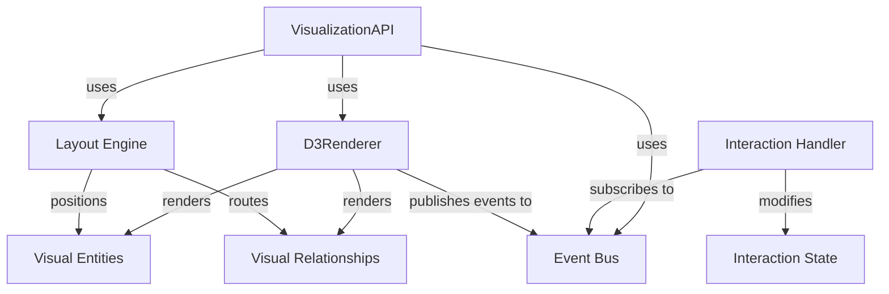

# Visualization Engine

The Data Dictionary Agency (DDA) Visualization Engine is a modular, extensible system for rendering interactive ER diagrams from schema relationship data. This implementation satisfies the requirements of SUBTASK_002.4 (Visualization Engine Foundation).

## Architecture

The visualization engine is built around the following key components:



### Core Components

#### Models

- **VisualEntity**: Represents an entity in the ER diagram with properties, position, and visual state.
- **VisualRelationship**: Represents a relationship between entities with type, direction, and cardinality.
- **LayoutOptions**: Configuration options for layout algorithms.
- **InteractionState**: Tracks current interaction state (zoom, pan, selection).

#### Layouts

- **BaseLayout**: Abstract base class for all layout algorithms.
- **ForceDirectedLayout**: Physics-based layout using force simulation.
- **HierarchicalLayout**: Tree-like layout based on relationship structure.
- **CircularLayout**: Arranges entities in a circular pattern.

#### Events

- **EventBus**: Central event system for communication between components.

#### Interactions

- **InteractionHandler**: Manages user interactions (zoom, pan, select) with the visualization.

## Usage

### Basic Example

```javascript
import { VisualizationAPI } from './visualization/api/visualization-api';
import { VisualEntity, VisualRelationship } from './visualization/models';
import { EventBus } from './visualization/events/event-bus';

// Create container element
const container = document.getElementById('diagram-container');

// Create visualization
async function createVisualization() {
  // Create event bus for communication
  const eventBus = new EventBus();
  
  // Create visualization API
  const visualizationAPI = new VisualizationAPI({ 
    eventBus,
    defaultLayout: 'force-directed'
  });
  
  // Create sample entities
  const entities = [
    new VisualEntity({
      id: 'entity1',
      label: 'User',
      type: 'table',
      properties: [
        { name: 'id', type: 'integer', isPrimary: true },
        { name: 'username', type: 'string', isRequired: true },
        { name: 'email', type: 'string', isRequired: true }
      ]
    }),
    new VisualEntity({
      id: 'entity2',
      label: 'Order',
      type: 'table',
      properties: [
        { name: 'id', type: 'integer', isPrimary: true },
        { name: 'userId', type: 'integer', isRequired: true },
        { name: 'orderDate', type: 'datetime', isRequired: true }
      ]
    })
  ];
  
  // Create sample relationships
  const relationships = [
    new VisualRelationship({
      id: 'rel1',
      source: 'entity1',
      target: 'entity2',
      type: 'oneToMany',
      label: 'places',
      sourceCardinality: '1',
      targetCardinality: '*'
    })
  ];
  
  // Generate diagram
  const diagram = await visualizationAPI.generateDiagram(
    container, 
    entities, 
    relationships, 
    { layout: 'force-directed' }
  );
  
  return diagram;
}

// Create and render the visualization
createVisualization()
  .then(diagram => {
    console.log('Diagram created:', diagram);
    
    // Example of diagram interaction
    diagram.update({
      // Add new entities or relationships
    });
  })
  .catch(error => {
    console.error('Error creating diagram:', error);
  });
```

### Layout Options

#### Force-Directed Layout

```javascript
const options = {
  layout: 'force-directed',
  force: {
    strength: -300,        // Repulsive force
    distance: 150,         // Target distance between nodes
    iterations: 300        // Simulation steps
  }
};
```

#### Hierarchical Layout

```javascript
const options = {
  layout: 'hierarchical',
  hierarchical: {
    direction: 'TB',       // Top to bottom (also: 'LR', 'RL', 'BT')
    levelDistance: 150,    // Distance between levels
    nodeDistance: 100      // Distance between nodes on same level
  }
};
```

#### Circular Layout

```javascript
const options = {
  layout: 'circular',
  circular: {
    radius: 200,           // Circle radius
    startAngle: 0,         // Starting angle (radians)
    endAngle: 2 * Math.PI  // Ending angle (radians)
  }
};
```

## Event System

The visualization engine uses an event-driven architecture for communication between components:

### Core Events

| Event Name | Description | Data |
|------------|-------------|------|
| `interaction.zoom` | Triggered on zoom | `{ scale, point }` |
| `interaction.pan` | Triggered on pan | `{ translate, delta }` |
| `interaction.selectionChanged` | Triggered when selection changes | `{ entities, relationships }` |
| `interaction.entityClick` | Triggered when entity is clicked | `{ entity, point }` |
| `interaction.entityDoubleClick` | Triggered when entity is double-clicked | `{ entity, point }` |

### Subscribing to Events

```javascript
const eventBus = new EventBus();

// Subscribe to entity click event
eventBus.subscribe('interaction.entityClick', (data) => {
  console.log('Entity clicked:', data.entity);
  // Handle entity click
});
```

## Performance Considerations

- **Layout Calculations**: Layout algorithms (especially force-directed) can be computationally expensive for large diagrams. Consider using hierarchical or circular layouts for diagrams with many entities.
- **Progressive Rendering**: For very large diagrams, consider enabling progressive rendering to improve initial load time.
- **Interaction Throttling**: Zoom and pan events are throttled to improve performance during interaction.

## Extension Points

The visualization engine is designed to be extensible:

- **Custom Layouts**: Create new layout algorithms by extending `BaseLayout`.
- **Custom Renderers**: Implement alternative renderers (e.g., WebGL-based) by following the renderer interface.
- **Custom Interactions**: Add new interaction modes by extending the interaction system.

## To-Do (Future Enhancements)

1. Implement D3.js-based renderer
2. Add styling customization options
3. Implement progressive rendering for large diagrams
4. Add export capabilities (PNG, SVG, PDF)
5. Implement additional layout algorithms
