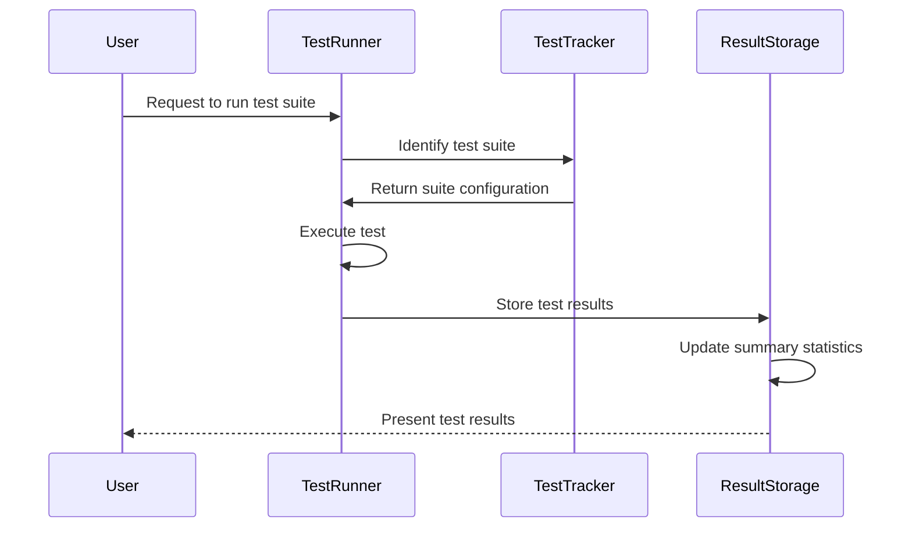
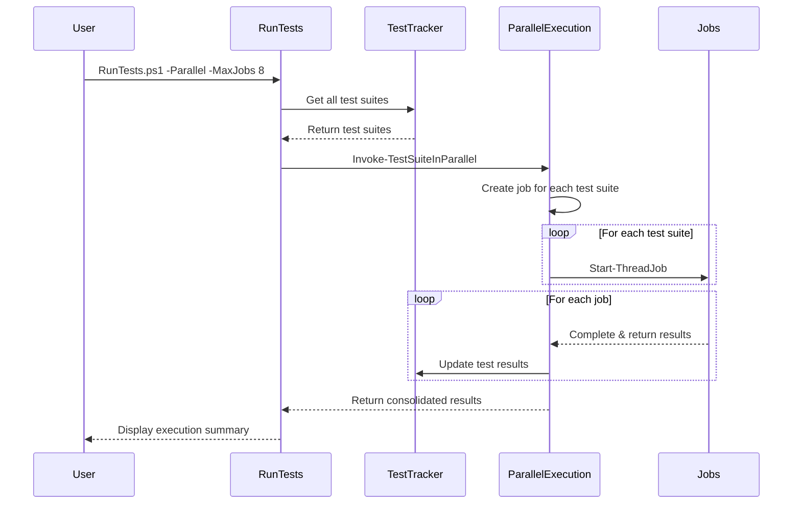
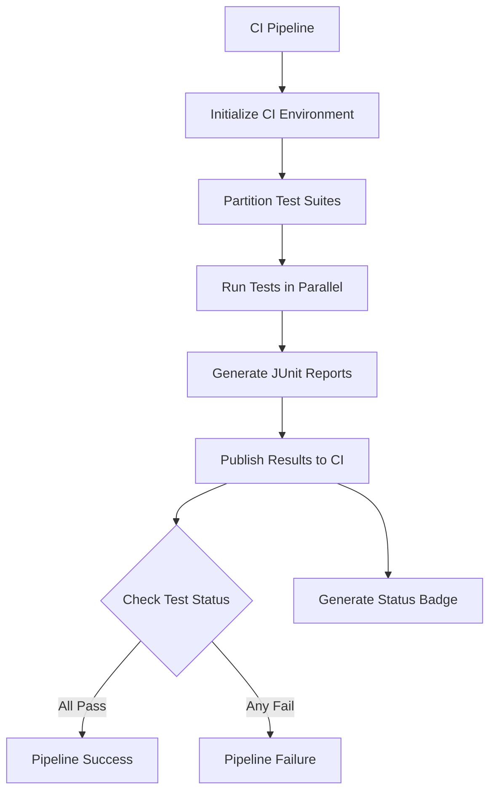
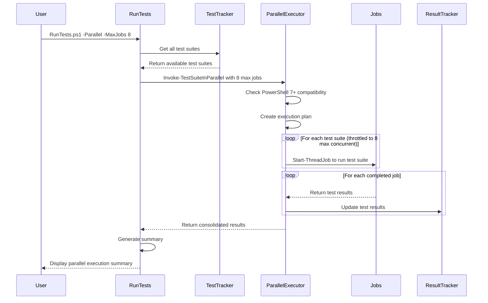
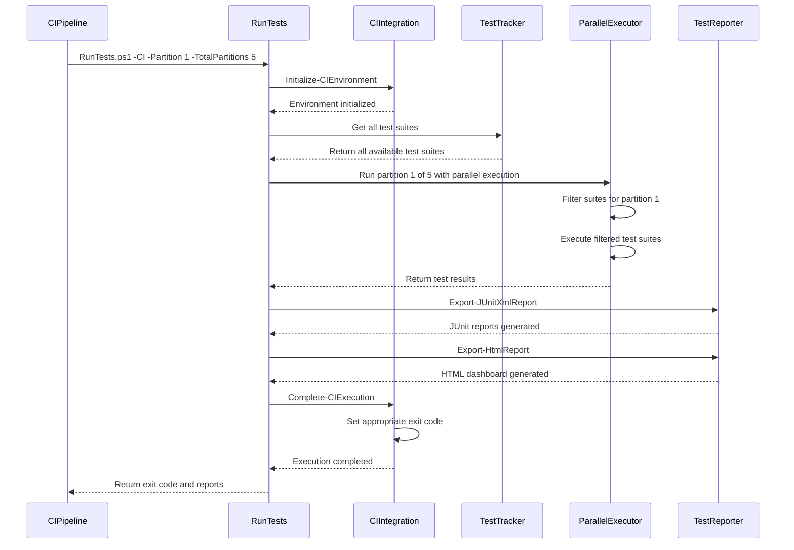
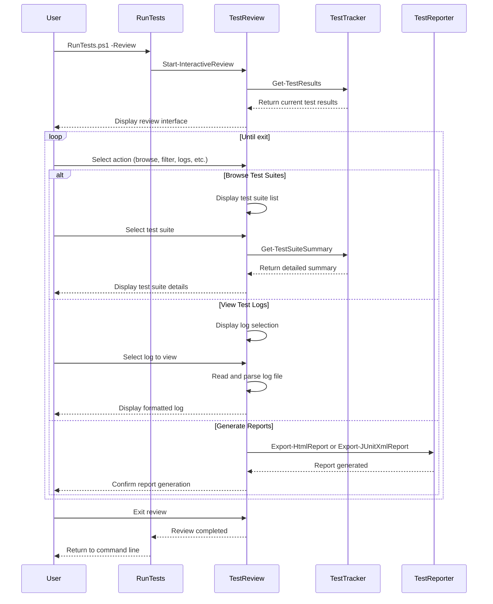

# Test Suite Management System

## Overview

The Test Suite Management System provides a solution for running individual test suites incrementally and maintaining a comprehensive tracking system across test runs. This is especially useful for projects with large test suites where running all tests at once would cause context overflow in interactive environments. The system now supports parallel execution of tests to significantly reduce test execution time.



The system consists of the following core components:

1. `TestTracker.ps1`: PowerShell module for tracking and executing tests
2. `RunTests.ps1`: Command-line interface for the test management system
3. `TestReporter.ps1`: Report generation for test results
4. `CIIntegration.ps1`: CI/CD integration utilities
5. `TestReview.ps1`: Interactive test review interface
6. `test-results.json`: JSON file that stores test results and tracking information
7. `TestTracker.Tests.ps1`: Validation tests for the test management system

## Installation

1. Ensure PowerShell 5.0 or later is installed
2. Copy the test tracking files to your project's `tests` directory
3. Run `./RunTests.ps1 -List` to verify the installation

## Directory Structure

```
project/
├── test-results.json          # Test results tracking file
├── test-logs/                 # Generated log files (created automatically)
├── test-reports/              # Generated reports (created automatically)
│   ├── junit/                 # JUnit XML reports for CI integration
│   └── html/                  # HTML dashboard reports
└── tests/
    ├── TestTracker.ps1        # Core tracking functionality
    ├── TestReporter.ps1       # Report generation
    ├── CIIntegration.ps1      # CI/CD integration
    ├── TestReview.ps1         # Interactive test review
    ├── RunTests.ps1           # Command-line interface
    ├── TestTracker.Tests.ps1  # Validation tests
    ├── README.md              # This documentation
    ├── unit/                  # Python unit tests
    └── ...
```

## Usage

### Running Tests

The system supports both Python pytest tests and JavaScript Jest tests. You can run tests either through command-line parameters or through an interactive menu.

#### Command-Line Interface

```powershell
# List all available test suites
./tests/RunTests.ps1 -List

# Run a specific Python test suite
./tests/RunTests.ps1 -Suite test_avro_parser -Type python

# Run all tests in parallel with 10 concurrent jobs
./tests/RunTests.ps1 -Parallel -MaxJobs 10

# Run tests in CI mode with partitioning for distributed execution
./tests/RunTests.ps1 -CI -Partition 1 -TotalPartitions 5

# Run tests and export JUnit XML reports
./tests/RunTests.ps1 -ExportJUnit

# Run tests and export HTML dashboard reports
./tests/RunTests.ps1 -ExportHtml

# Start interactive test review session
./tests/RunTests.ps1 -Review

# Show a summary of all test results
./tests/RunTests.ps1 -Summary

# Show detailed results for a specific test suite
./tests/RunTests.ps1 -Detail -Suite test_avro_parser -Type python

# Run in interactive mode
./tests/RunTests.ps1 -Interactive
```

#### Interactive Mode

```powershell
./tests/RunTests.ps1
```

This will display a menu with the following options:

1. List all test suites
2. Run a Python test suite
3. Run a JavaScript test suite
4. Show test results summary
5. Show detailed test results
6. Run all tests in parallel
7. Export test reports
8. Run interactive test review
9. Quit

### Parallel Execution

The system supports running tests in parallel for improved performance, particularly useful for large test suites:

```powershell
# Run all tests in parallel with default concurrency (5 jobs)
./tests/RunTests.ps1 -Parallel

# Run with custom concurrency level
./tests/RunTests.ps1 -Parallel -MaxJobs 10
```

Parallel execution offers significant performance improvements:



Key Features:
- PowerShell 7.0+ compatibility check with automatic fallback to sequential execution
- Throttle limit control with MaxJobs parameter
- Progress tracking and real-time status updates
- CI/CD integration with partitioning capability

### Report Generation

The system can generate several types of reports for visualization and CI/CD integration:

#### JUnit XML Reports

```powershell
# Export JUnit XML reports
./tests/RunTests.ps1 -ExportJUnit
```

JUnit XML reports are compatible with most CI/CD systems and provide detailed test results in a standardized format. Reports are generated in the `test-reports/junit/` directory.

#### HTML Dashboard

```powershell
# Export HTML dashboard
./tests/RunTests.ps1 -ExportHtml
```

The HTML dashboard provides a human-readable overview of test results, including:
- Overall test status summary
- Individual test suite details
- Pass/fail statistics
- Test duration metrics
- Detailed test case information

HTML reports are generated in the `test-reports/html/` directory.

#### Comparison Reports

The system can also generate comparison reports between test runs:

```powershell
# Generate a comparison report between previous and current test runs
$testResults = Get-TestResults
Export-ComparisonReport -Previous $previousResults -Current $currentResults -SuiteName "test_avro_parser"
```

Comparison reports highlight:
- Changes in test status
- Performance improvements or regressions
- Fixed and newly broken tests
- Overall trend analysis

### CI/CD Integration

The system integrates with CI/CD pipelines for automated testing via GitHub Actions:

```powershell
# Run in CI mode
./tests/RunTests.ps1 -CI

# Run with partitioning for distributed execution
./tests/RunTests.ps1 -CI -Partition 0 -TotalPartitions 10
```

A complete GitHub Actions workflow is included at `.github/workflows/test-pipeline.yml`, which implements:

- Matrix-based parallel execution across 10 partitions
- Dependency caching for Python and Node.js
- Automatic test result collection and consolidation
- Status badge generation for repository display

The workflow consists of two main jobs:
1. **Test job**: Runs tests in parallel with matrix strategy
2. **Report job**: Consolidates results and generates summary reports



CI mode features:
- Automatic environment detection (GitHub Actions)
- Test partitioning for distributed execution
- JUnit XML and HTML report generation
- Workflow outputs for downstream job consumption
- Status badge generation for repository README
- Exit code handling for pipeline success/failure

To display the status badge in your repository README:
```markdown

```

### Interactive Test Review

The system provides an interactive test review interface for analyzing test results:

```powershell
# Start interactive test review
./tests/RunTests.ps1 -Review
```

The test review interface allows:
- Browsing through test suites and their results
- Detailed examination of failing tests
- Viewing test logs
- Comparing test runs
- Filtering and searching test results
- Generating targeted reports

### Test Results

Test results are stored in `test-results.json` at the root of your project. This file maintains:

- A summary of all test execution
- Detailed results for each test suite
- Test case results for each suite
- Overall pass/fail status

```json
{
  "summary": {
    "lastUpdated": "2025-04-30T20:47:00-07:00",
    "totalSuites": 18,
    "completedSuites": 5,
    "passingSuites": 4,
    "failingSuites": 1,
    "overallStatus": "IN_PROGRESS"
  },
  "testSuites": {
    "python": {
      "test_avro_parser": {
        "path": "tests/unit/test_avro_parser.py",
        "lastRun": "2025-04-30T20:40:00-07:00",
        "status": "PASS",
        "duration": 1.25,
        "tests": {
          "total": 8,
          "passed": 8,
          "failed": 0,
          "skipped": 0
        },
        "details": [
          {"name": "test_parse_avro_schema", "status": "PASS"},
          {"name": "test_invalid_avro_schema", "status": "PASS"}
        ]
      }
    },
    "javascript": {
      "ErrorMessage": {
        "path": "src/ui/components/__tests__/ErrorMessage.test.js",
        "lastRun": "2025-04-30T20:45:00-07:00",
        "status": "FAIL",
        "duration": 0.75,
        "tests": {
          "total": 3,
          "passed": 2,
          "failed": 1,
          "skipped": 0
        },
        "details": [
          {"name": "renders without crashing", "status": "PASS"},
          {"name": "displays the error message", "status": "PASS"},
          {"name": "handles null error message", "status": "FAIL"}
        ]
      }
    }
  }
}
```

## Architecture

The test tracking system uses the following architecture to manage test execution and results:

```mermaid
flowchart TD
    User[User] --> RunTests[RunTests.ps1]
    RunTests --> TestTracker[TestTracker.ps1]
    RunTests --> TestReporter[TestReporter.ps1]
    RunTests --> CIIntegration[CIIntegration.ps1]
    RunTests --> TestReview[TestReview.ps1]
    
    subgraph TestDiscovery
        TestTracker --> PythonSuites[Get-PythonTestSuites]
        TestTracker --> JSSuites[Get-JavaScriptTestSuites]
    end
    
    subgraph TestExecution
        TestTracker --> PythonExec[Invoke-PythonTestSuite]
        TestTracker --> JSExec[Invoke-JavaScriptTestSuite]
        TestTracker --> ParallelExec[Invoke-TestSuiteInParallel]
    end
    
    subgraph ResultsManagement
        TestTracker --> GetResults[Get-TestResults]
        TestTracker --> SaveResults[Save-TestResults]
        TestTracker --> UpdateSummary[Update-TestSummary]
    end
    
    subgraph Reporting
        TestTracker --> SuiteSummary[Get-TestSuiteSummary]
        TestReporter --> JUnitReport[Export-JUnitXmlReport]
        TestReporter --> HtmlReport[Export-HtmlReport]
        TestReporter --> FocusedReport[Export-FocusedHtmlReport]
        TestReporter --> ComparisonReport[Export-ComparisonReport]
    end
    
    subgraph CISystem
        CIIntegration --> InitCI[Initialize-CIEnvironment]
        CIIntegration --> CompleteCI[Complete-CIExecution]
    end
    
    subgraph ReviewSystem
        TestReview --> StartReview[Start-InteractiveReview]
    end
    
    PythonSuites --> InvokeTest[Invoke-TestSuite]
    JSSuites --> InvokeTest
    InvokeTest --> PythonExec
    InvokeTest --> JSExec
    PythonExec --> SaveResults
    JSExec --> SaveResults
    GetResults --> ResultsJSON[test-results.json]
    SaveResults --> ResultsJSON
    UpdateSummary --> ResultsJSON
    ResultsJSON --> GetResults
    ParallelExec --> InvokeTest
    
    JUnitReport --> JUnitFiles[test-reports/junit/*.xml]
    HtmlReport --> HtmlFiles[test-reports/html/test-report.html]
    FocusedReport --> FocusedFiles[test-reports/html/{suite}-report.html]
    ComparisonReport --> ComparisonFiles[test-reports/html/{suite}-comparison.html]
```

## Core Components

### TestTracker.ps1

This module provides the core functionality for tracking and executing tests:

- Test suite discovery
- Test execution (sequential and parallel)
- Results tracking
- Reporting

#### Key Functions

- `Get-PythonTestSuites`: Discovers Python test suites
- `Get-JavaScriptTestSuites`: Discovers JavaScript test suites
- `Get-AllTestSuites`: Gets both Python and JavaScript test suites
- `Invoke-TestSuite`: Executes a test suite and updates the results
- `Invoke-TestSuiteInParallel`: Executes multiple test suites in parallel
- `Get-TestResults`: Gets the current test results
- `Get-TestSuiteSummary`: Generates a summary of test results

### TestReporter.ps1

This module provides functionality for generating various report formats:

- JUnit XML reports for CI systems
- HTML dashboard for human review
- Focused reports for specific test suites
- Comparison reports between test runs

#### Key Functions

- `Export-JUnitXmlReport`: Exports test results to JUnit XML format
- `Export-HtmlReport`: Generates an HTML dashboard of test results
- `Export-FocusedHtmlReport`: Creates a detailed HTML report for a specific test suite
- `Export-ComparisonReport`: Generates a comparison between two test runs

### CIIntegration.ps1

This module provides utilities for CI/CD pipeline integration:

- Environment initialization for CI
- Test partitioning for distributed execution
- CI-specific logging and reporting
- Pipeline status handling

#### Key Functions

- `Initialize-CIEnvironment`: Sets up the environment for CI execution
- `Complete-CIExecution`: Finalizes CI execution and sets appropriate exit codes
- `Get-CIPartitionedTests`: Distributes tests across CI partitions

### TestReview.ps1

This module provides an interactive interface for reviewing test results:

- Suite browsing and filtering
- Detailed test examination
- Log viewing and analysis
- Trend identification

#### Key Functions

- `Start-InteractiveReview`: Launches the interactive review interface
- `Show-TestSuiteDetails`: Displays detailed information for a test suite
- `Show-TestLogViewer`: Displays and analyzes test logs
- `Show-TrendAnalysis`: Analyzes test execution trends

### RunTests.ps1

This script provides a command-line interface for the test tracking system:

- Command-line arguments for different operations
- Interactive mode for menu-driven testing
- Results display formatting
- Integration with all system components

## Workflow Examples

### Running Tests in Parallel



### CI/CD Integration with Partitioning



### Interactive Test Review



## Troubleshooting

### Common Issues

1. **Test discovery fails**
   - Ensure the test files follow the naming convention (test_*.py for Python, *.test.js for JavaScript)
   - Check that the test directories exist and are accessible

2. **Test execution fails**
   - Verify that pytest/Jest is installed and available in the PATH
   - Check the log files in the test-logs directory for error details

3. **Results file errors**
   - If the test-results.json file becomes corrupted, delete it and the system will create a new one
   - Ensure the file is not locked by another process

4. **Parallel execution issues**
   - Verify you're using PowerShell 7.0 or later for parallel execution
   - If parallel execution fails, try reducing the MaxJobs parameter
   - For resource-intensive tests, use a lower MaxJobs value

5. **CI integration problems**
   - Ensure the CI environment variables are correctly set
   - Check that the test partitioning is correctly configured
   - Verify JUnit reports are being generated in the expected location

### Log Files

Each test run generates a log file in the `test-logs` directory. The log file contains the raw output from the test execution, which can be useful for troubleshooting issues.

## Extending the System

### Adding Support for New Test Types

To add support for a new test type (e.g., JUnit for Java), follow these steps:

1. Add a new discovery function in `TestTracker.ps1` (e.g., `Get-JavaTestSuites`)
2. Add a new execution function (e.g., `Invoke-JavaTestSuite`)
3. Update the `test-results.json` structure to include the new test type
4. Update the `RunTests.ps1` script to handle the new test type
5. Extend the reporting modules to handle the new test type

### Customizing Report Formats

The system already supports JUnit XML and HTML reports, but you could extend it to:

- Generate PDF reports
- Create interactive visualizations
- Export to other CI-compatible formats
- Generate trend analysis reports

### Adding New CI/CD Integrations

The current CI integration is generic, but you could extend it for specific CI systems:

- GitHub Actions specific integration
- Azure DevOps Pipeline integration
- Jenkins integration
- CircleCI or Travis CI integration

## Validation Tests

The system includes validation tests to ensure it functions correctly:

```powershell
# Run validation tests
./tests/TestTracker.Tests.ps1
```

The validation tests verify:

- Results file initialization
- Results retrieval and saving
- Summary updates
- Test suite discovery
- Results summary generation
- Parallel execution functionality
- Report generation

## License

This test tracking system is released under the MIT License.
