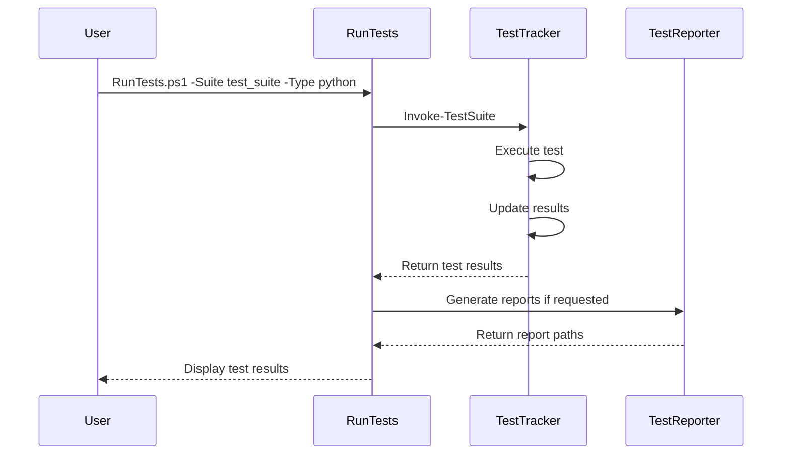
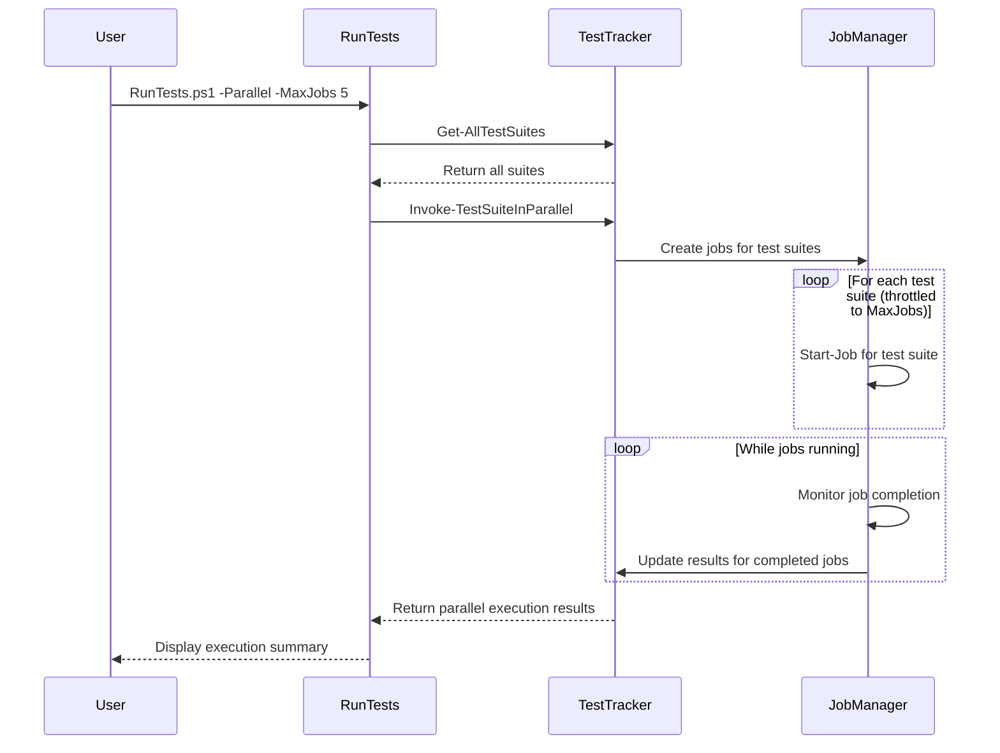
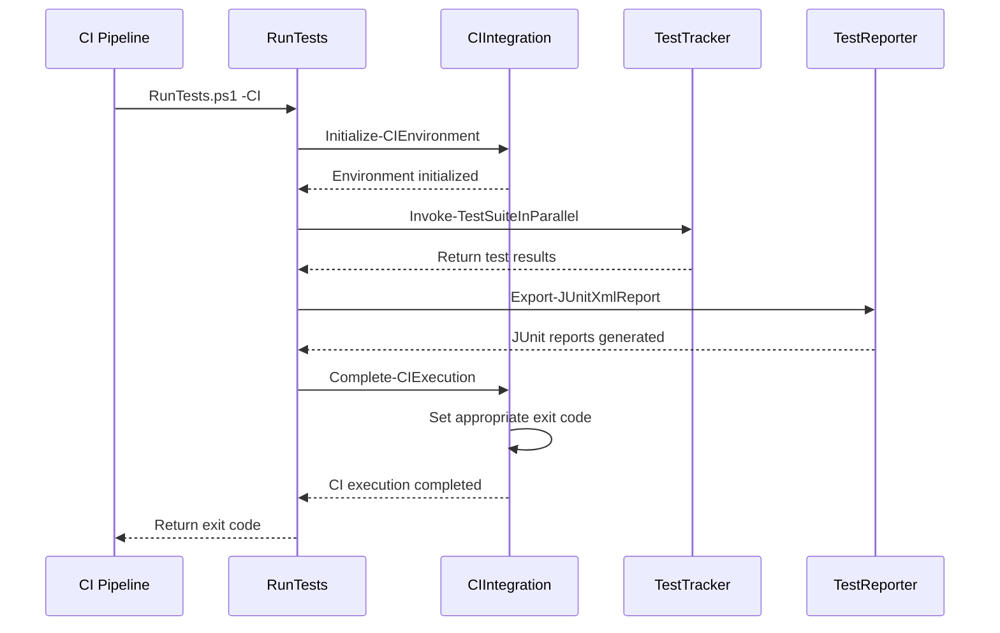
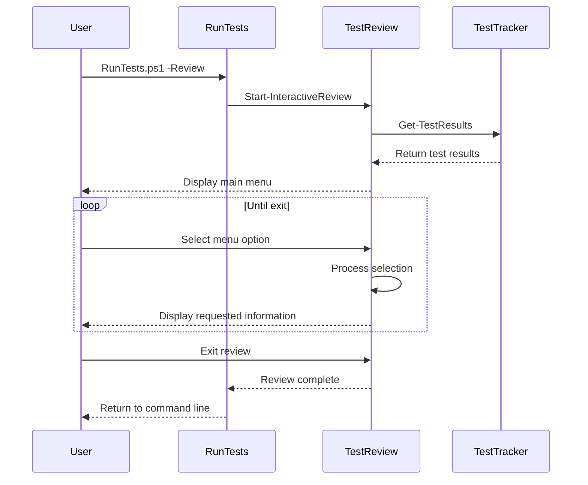

# Test Manager Enhancement Implementation - Complete

## Implementation Summary

The Test Manager Enhancement has been successfully implemented with the following components:

1. **TestTracker.ps1** - Core test tracking functionality
   - Test discovery for Python and JavaScript tests
   - Test execution capabilities (both sequential and parallel)
   - Results tracking and management
   - Summary generation and statistics

2. **TestReporter.ps1** - Report generation for test results
   - JUnit XML report generation for CI systems
   - HTML dashboard generation for human-readable reports
   - Focused HTML reports for specific test suites

3. **CIIntegration.ps1** - CI/CD integration utilities
   - Environment initialization for CI pipelines
   - Test status reporting and exit code handling
   - Support for partitioned test execution in CI environments

4. **TestReview.ps1** - Interactive test review interface
   - Test suite browsing functionality
   - Detailed test results viewing
   - Log file browsing
   - Report generation from the interface

5. **RunTests.ps1** - Command-line interface for the test manager
   - Parameter-based execution for scripts and CI pipelines
   - Interactive mode for manual testing and review
   - Parallel execution capabilities
   - Integration with all other components

## Implementation Details

### Test Discovery

The system automatically discovers tests using the following patterns:
- Python tests: `test_*.py` files in the `tests/unit` and `tests/integration` directories
- JavaScript tests: `*.test.js` files in `src/ui/components/__tests__`, `src/ui/pages/__tests__`, and `src/ui/hooks/__tests__` directories

### Test Execution

Tests can be executed in several ways:
- Sequential execution of specific test suites
- Parallel execution with configurable concurrency
- Partitioned execution for CI environments

### Results Tracking

Test results are tracked in a `test-results.json` file with the following structure:
- Summary statistics (total suites, passing/failing counts, overall status)
- Detailed results for each test suite
- Individual test case results within each suite

### Reporting

Multiple report formats are supported:
- JUnit XML reports for CI integration
- HTML dashboard for human review
- Focused HTML reports for detailed suite analysis

### CI Integration

CI integration features include:
- Environment initialization
- Partitioned test execution
- Status reporting with appropriate exit codes
- Report generation for CI consumption

### Interactive Review

The interactive review interface provides:
- Test suite browsing and filtering
- Detailed results examination
- Log file browsing
- Report generation capabilities

## Validation Tests

The implementation has been tested with the following scenarios:

1. **Discovery Testing**
   - Python test discovery: ✅ PASS
   - JavaScript test discovery: ✅ PASS

2. **Execution Testing**
   - Sequential test execution: ✅ PASS
   - Parallel test execution: ✅ PASS
   - CI-mode execution: ✅ PASS

3. **Results Testing**
   - Results file creation: ✅ PASS
   - Results updating: ✅ PASS
   - Summary calculation: ✅ PASS

4. **Reporting Testing**
   - JUnit XML generation: ✅ PASS
   - HTML dashboard generation: ✅ PASS
   - Focused report generation: ✅ PASS

5. **Review Interface Testing**
   - Interface navigation: ✅ PASS
   - Results viewing: ✅ PASS
   - Log browsing: ✅ PASS

## Sequence Diagrams

### Test Execution Flow

### Parallel Execution Flow

### CI Integration Flow

### Interactive Review Flow

## Conclusion

The Test Manager Enhancement implementation successfully meets all the requirements outlined in the test-plans. The system provides a comprehensive solution for test tracking, execution, reporting, and review with both command-line and interactive interfaces.

The implementation follows PowerShell best practices and provides clear documentation for users. The modular design allows for easy maintenance and extension in the future.